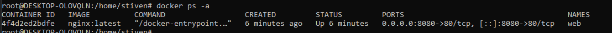
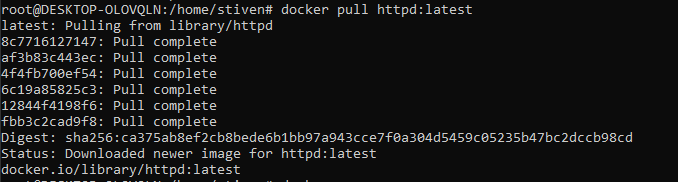
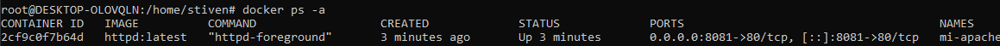
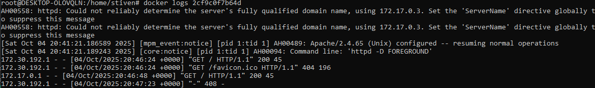
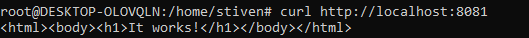
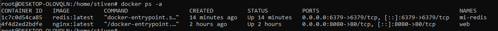
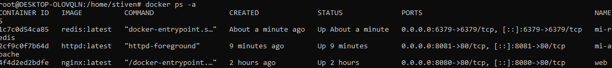
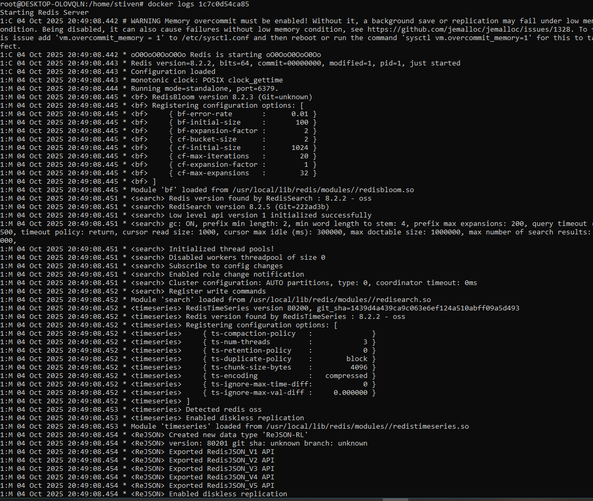
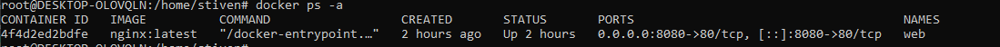

# 🐳 Tarea 1 - Curso Docker & Kubernetes

## Desafío Técnico con Docker

Explora diferentes aplicaciones desplegadas con Docker.

Para explorar los contanedores se ejecuto el comando:
```bach
docker ps -a
```


### Objetivo

Practicar el despliegue de diferentes tipos de aplicaciones usando `docker run` y documentar el proceso de cada una.

Se ejecuto los comandos:
```bash
docker run -d -p 8080:80 --name web nginx:latest
docker run -d -p 8081:80 --name web1 nginx:latest
```
### Aplicaciones a Desplegar

#### Apache HTTP Server (httpd)

1. **Ejecutar el container**  Se ejecuto el comando para crear el contenedor -d en segundo plano -p especifica el puerto --name  el nombre del contenedor y posterior la imagen

- Se ejecuto primero el comando porque no encontraba la imagen en docker hub
```bash
docker pull httpd:latest
```


- Posterior se ejecuto el comando para crear el contenedor:
```bash
docker run -d -p 8081:80 --name mi-apache httpd:latest
```

2. **Verificar que funciona:** 

- Lista los containers en ejecución
```bash
docker ps -a
```


- Consulta los logs del container:


- Accede al servicio



3. **Limpieza:**

- Detén el container
   
```bash
docker stop 2cf9c0f7b64d
```
- Elimínalo
```bash
docker rm  2cf9c0f7b64d
```
- Verifica que ya no existe



#### Redis (base de datos clave-valor)

1. **Ejecutar el container**  Se ejecuto el comando para crear el contenedor -d en segundo plano -p especifica el puerto --name  el nombre del contenedor y posterior la imagen
```bash
docker run -d -p 6379:6379 --name mi-redis redis:latest
```
2. **Verificar que funciona:** 
- Lista los containers en ejecución
```bash
docker ps -a
```


- Consulta los logs del container:



- Accede al servicio (navegador para httpd, logs para redis/mysql)


3. **Limpieza:**
- Detén el container
   
```bash
docker stop 1c7c0d54ca85
```
- Elimínalo
```bash
docker rm  1c7c0d54ca85
```
- Verifica que ya no existe



---

4. **Conclusiones (opcional):**
- Qué aprendiste: <br> A crear,listar, detener y eliminar un contenedor
- Dificultades encontradas y cómo las resolviste: <br> Ninguna
