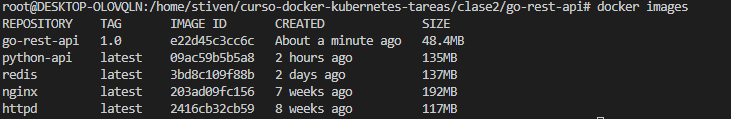
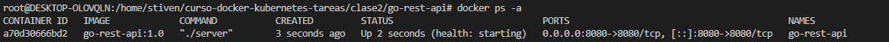
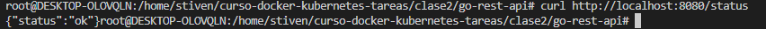
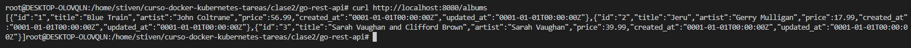
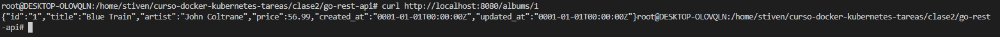
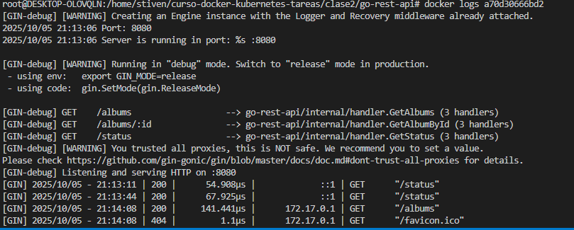
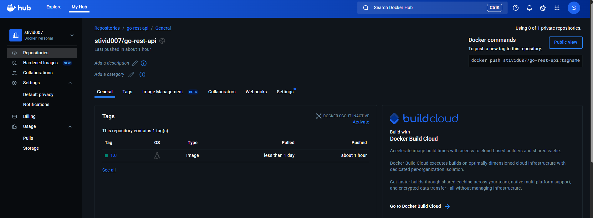
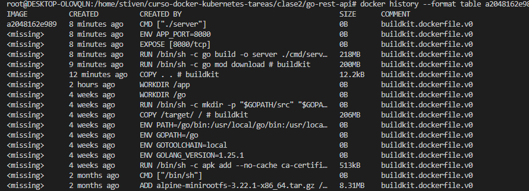
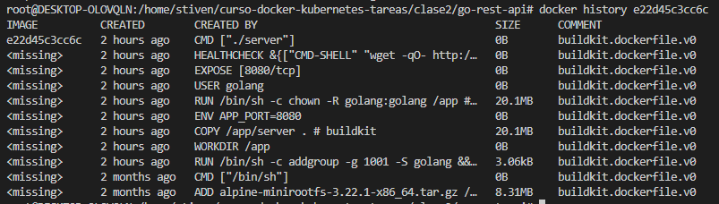

# 🐳  Tarea 2 - Dockerizar Aplicación con Multi-Stage Build


## Aplicación

**Lenguaje:** Golang <br>
**Framework:** Gi <br>
**Descripción:** API REST para gestión de albums

**Endpoints:**
- GET /albums - Lista todos los albums
- GET /albums/:id - Busca un album por id
- GET /status - Verifica el estado de la aplicacion

## Dockerfile

```dockerfile
# Stage 1: Build
FROM golang:1.25.1-alpine AS builder
#Crear directorio de trabajo 
WORKDIR /app
#Copiar dependencias necesarias
COPY go.mod go.sum ./
#Descargar dependencias
RUN go mod download
#Copiar todo el contenido del proyecto
COPY . .
#Compila el codigo y genera los binarios en la salida server
RUN go build -o server ./cmd/server

# Stage 2: Production
FROM alpine:latest
#Crea un usuario por seguridad
RUN addgroup -g 1001 -S golang && adduser -S golang -u 1001
#Crea el directorio de trabajo
WORKDIR /app
#Copia el contenido del anterior stage
COPY --from=builder /app/server .
#Configura una variable de entorno
ENV APP_PORT=8080
#Asgina permisos
RUN chown -R golang:golang /app
USER golang
#Expone la aplicacion en el puerto 8080
EXPOSE 8080
#Establece un monitor de servicio para validar la disponibilidad de la aplicacion
HEALTHCHECK --interval=30s --timeout=5s --start-period=10s --retries=3 \
 CMD wget -qO- http://localhost:8080/status || exit 1
#Ejecuta la aplicacion
CMD ["./server"]
```

## Explicación:

| Stage | Propósito |
|-------|-----------|
| Build                                 | Instalar todas las dependencias |
| WORKDIR /app                          |Crear directorio de trabajo      |
| COPY go.mod go.sum ./                 |Copiar dependencias necesarias  |
| RUN go mod download                   | Descargar dependencias         |
| COPY . .                              | Copiar todo el contenido del proyecto         |
| RUN go build -o server ./cmd/server   | Compila el codigo y genera los binarios en la salida server        |

| Stage | Propósito |
|-------|-----------|
| Production | Solo runtime... |
| RUN addgroup -g 1001 -S golang && adduser -S golang -u 1001   | Crea un usuario por seguridad         |
| WORKDIR /app   | Crea el directorio de trabajo         |
| COPY --from=builder /app/server .   | Copia el contenido del anterior stage         |
|ENV APP_PORT=8080   | Configura una variable de entorno        |
|RUN chown -R golang:golang /app   | Asgina permisos         |
| USER golang   |Cambia de usuario a golang         |
| EXPOSE 8080   |Expone la aplicacion en el puerto 8080        |
|HEALTHCHECK --interval=30s --timeout=5s --start-period=10s --retries=3 CMD wget -qO- http://localhost:8080/status |Establece un monitor de servicio para validar la disponibilidad de la aplicacion       |
| CMD ["./server"]   |Ejecuta la aplicacion         |

## Build

```bash
docker build -t go-rest-api:1.0 .
```

**Salida:**
```
[+] Building 147.7s (17/17) FINISHED 
docker:default
=> [internal] load build definition from Dockerfile   
```

**Tamaño final:**  48.4MB

## Testing

 <br> <br>
 <br> <br>
 <br> <br>
 <br> <br>
 <br> <br>
 <br> <br>

## Docker Hub

**URL:** https://hub.docker.com/repository/docker/stivid007/go-rest-api/general



## Optimizaciones

- Multi-stage build: redujo de 632MB a 48.4MB
 <br> <br>

- .dockerignore excluye node_modules

Sin Multi-stage
 <br> <br>

Con Multi-stage
 <br> <br>

## Conclusiones

Aprendí a optimizar imágenes en multistage

---