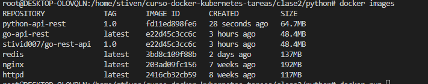
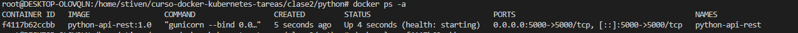
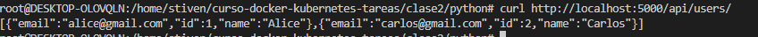
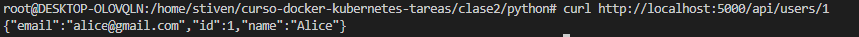
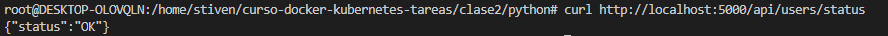
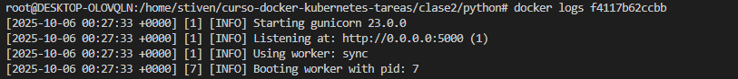
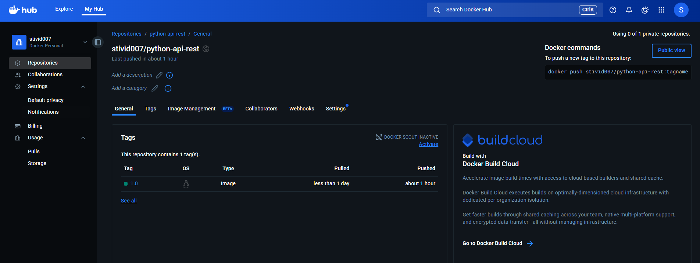
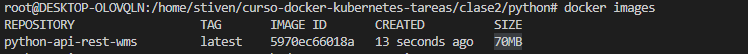
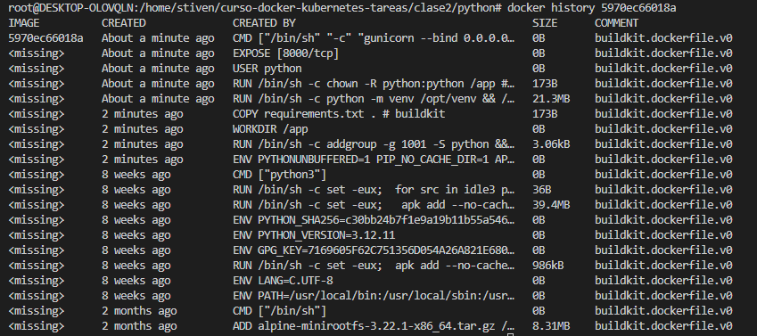
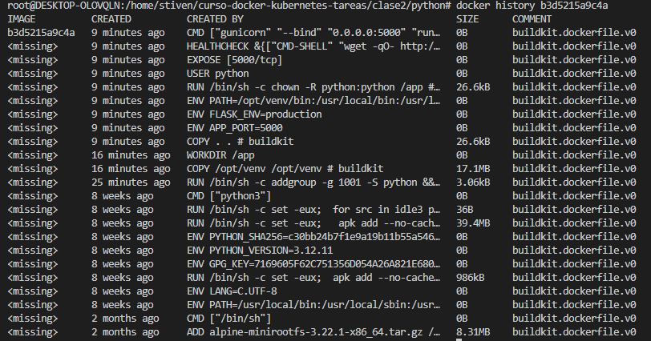

# 🐳  Tarea 2 - Dockerizar Aplicación con Multi-Stage Build


## Aplicación

**Lenguaje:** Python <br>
**Framework:** Flask <br>
**Descripción:** API REST para gestión de usuarios

**Endpoints:**
- GET /api/users        - Lista todos los usuarios
- GET /api/users/:id    - Busca un usuario por id
- GET /api/users/status - Verifica el estado de la aplicacion
- POST /api/users       - Crea un usuario

## Dockerfile

```dockerfile
# Stage 1: Build
FROM python:3.12-alpine AS builder
WORKDIR /app
# Copiar requirements
COPY requirements.txt .
# Evitar generar los archivos bytecode 
ENV PYTHONDONTWRITEBYTECODE=1
ENV PYTHONUNBUFFERED=1
#Instalar dependencias y no almacenar en cache las depencias
RUN python -m venv /opt/venv && /opt/venv/bin/pip install --no-cache-dir -r requirements.txt

# Stage 2: Production
FROM python:3.12-alpine
RUN addgroup -g 1001 -S python && adduser -S python -u 1001
# Copiar los binarios del anterior stage
COPY --from=builder /opt/venv /opt/venv
WORKDIR /app
COPY . .
#Variable de entorno
ENV APP_PORT=5000
ENV FLASK_ENV=production
# Activar el entorno virtual
ENV PATH="/opt/venv/bin:$PATH"
RUN chown -R python:python /app
USER python
# Exponer el puerto del contenedor
EXPOSE ${APP_PORT}
HEALTHCHECK --interval=30s --timeout=5s --start-period=10s --retries=3 \
 CMD wget -qO- http://localhost:5000/api/users/status || exit 1
#CMD ["python", "run.py"]
CMD ["gunicorn", "--bind", "0.0.0.0:${APP_PORT}", "run:app"]
```

## Explicación:

| Stage | Propósito |
|-------|-----------|
| Build                                               |Instalar todas las dependencias |
| WORKDIR /app                                        |Crear directorio de trabajo      |
| COPY requirements.txt .                             |Copiar dependencias necesarias  |
| ENV PYTHONDONTWRITEBYTECODE=1                       |Evitar generar los archivos bytecode          |
| RUN python -m venv /opt/venv && /opt/venv/bin/pip install --no-cache-dir -r requirements.txt    | Instalar dependencias y no almacenar en cache las depencias        |


| Stage | Propósito |
|-------|-----------|
| Production | Solo runtime... |
| RUN addgroup -g 1001 -S golang && python -S python -u 1001   | Crea un usuario por seguridad         |
| WORKDIR /app                                                 | Crea el directorio de trabajo         |
| COPY --from=builder /opt/venv /opt/venv                      |  Copiar los binarios del anterior stage         |
|ENV APP_PORT=5000                                             | Configura una variable de entorno para produccion       |
|ENV FLASK_ENV=production                                      | Configura una variable de entorno para produccion        |
|RUN chown -R python:python /app                               | Asgina permisos         |
| USER python                                                  |Cambia de usuario a golang         |
| EXPOSE ${APP_PORT}                                           |Expone la aplicacion en el puerto 5000        |
|HEALTHCHECK --interval=30s --timeout=5s --start-period=10s --retries=3 CMD wget -qO- http://localhost:5000/api/users/status  |Establece un monitor de servicio para validar la disponibilidad de la aplicacion       |
| CMD ["gunicorn", "--bind", "0.0.0.0:${APP_PORT}", "run:app"]   |Ejecuta la aplicacion         |

## Build

```bash
docker build -t python-api-rest:1.0 .
```

**Salida:**
```
[+] Building 56.5s (15/15) FINISHED  
docker:default
 => [internal] load build definition from Dockerfile    
```

**Tamaño final:**  64.7MB

## Testing

 <br> <br>
 <br> <br>
 <br> <br>
 <br> <br>
 <br> <br>
 <br> <br>

## Docker Hub

**URL:** https://hub.docker.com/repository/docker/stivid007/python-api-rest/general



## Optimizaciones

- Multi-stage build: redujo de 70MB a 65.9MB
 <br> <br>

- Usando FROM python:3.12-slim usando Multi-stage el tamaño es de 135MB
python-rest-api 1.0 61e5529c0bb2 6 seconds ago 135MB

Sin Multi-stage
 <br> <br>

Con Multi-stage
 <br> <br>

## Conclusiones

Aprendí a optimizar imágenes en multistage y optimizar la imagenes

---