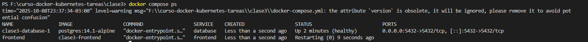
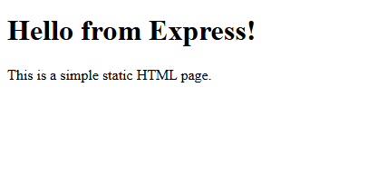
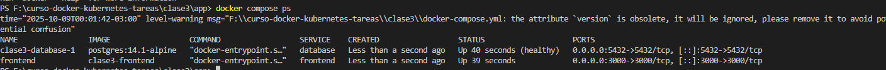
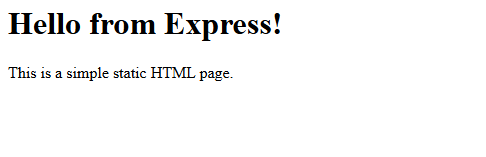
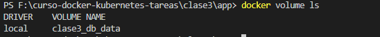
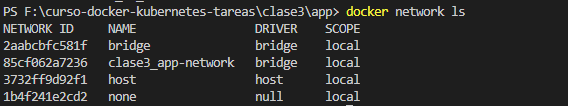
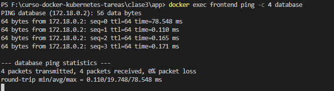

# 🐳 Tarea 3 - Aplicación Multi-Contenedor con Docker Compose


### 1. Encabezado

```markdown
# Nombre de la Aplicación

**Curso:** Docker & Kubernetes - Clase 3
**Estudiante:** Stiven Castellon Duran

Descripcion: La aplicacion muestra un texto de una pagina estatica en html.

```

### 2. Stack Tecnológico

```markdown
## Stack

- **App:** Node.js express
- **Base de datos:** PostgreSQL 
```

### 3. Cómo Ejecutar

```markdown
## Ejecución

1. Clonar:
   ```bash
   git clone https://github.com/tu-usuario/tu-repo.git
   cd clase3
   ```

2. Levantar servicios:
   ```bash
   docker compose up -d
   ```

3. Acceder:
   - API: http://localhost:3000
```

### 4. Cómo Probar

```markdown
## Verificación

1. Servicios corriendo:
```bash
   docker compose ps
```

2. Acceder a la web: http://localhost:3000

3. Verificar volumen persiste:
```bash
   docker compose down
   docker compose up -d
   docker volume ls  # la base de datos continua
```


### 5. Capturas de Pantalla

## Screenshots

### Servicios corriendo


### API funcionando



### 6. Conceptos Aplicados

```markdown
## Conceptos Docker

- Docker Compose con 2 servicios
- Red custom: `app-network`
- Volumen: `db-data` (persistencia)
- Variables de entorno
```

---

## Parte 5: Capturas de Pantalla

Mínimo **3 capturas**:

1. **Servicios corriendo**: `docker compose ps`

2. **Aplicación web funcionando**: 

3. **Volumen persistente**:



**Opcional (para destacar)**:
- `docker network ls` 


- `docker exec` 



---
