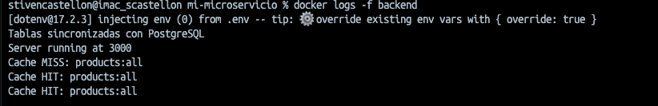

# 🐳 Tarea 4 - Microservicios con Cache y Gateway

**Curso:** Docker & Kubernetes - Clase 4.  <br>
**Estudiante:** Stiven Castellon Duran

### 1. Título y Descripción

- Nombre del proyecto: Sistema de E-commerce

- Descripción: La aplicacion permite la compra de hardware para computadoras, permite registra y poder hacer compras en linea.

- Tecnologías utilizadas: 
Frontend: Angular 
Backend: Nodejs express 
Base de datos: Postgres 

### 2. Arquitectura

┌───────────────────────────────────────────────────────────────────────┐
│              Docker Compose Stack                                     │
│                                                                       │
│  ┌─────────────┐    ┌──────────┐     ┌──────────┐    ┌──────────────┐ │
│  │   Cliente   │───►│          │───► │  Node.js │───►│   Postgres   │ │
│  │             │    │  Angular │     │  Express │    │   Database   │ │
│  └─────────────┘    │  Client  │     │  + Redis │    └──────────────┘ │
│                     │          │     │  Client  │            │        │
│                     └─────┬────┘     └─────┬────┘    ┌────── ▼──────┐ │
│                           │                |         |              | |
|                           |                ▼         │ db-data      │ │
│                           ▼            ┌──────────┐  │  (volume)    │ │
│                    ┌──────────────┐    |  NIGNX + |  └──────────────┘ │
│                    │ frontend_dist│    |  ASSETS  |                   │
│                    │  (volume)    │    |(Gateway) |                   │
│                    └──────────────┘    └─────-────┘                   │
│                           │                                           │
│  ┌────────────────────────▼──────────────────────┐                    │
│  │         app-network (custom)                  │                    │
│  │         DNS automático habilitado             │                    │
│  └───────────────────────────────────────────────┘                    │
└───────────────────────────────────────────────────────────────────────┘


### 3. Servicios


| Servicio | Tecnología | Puerto | Descripción |
|----------|------------|--------|-------------|
| gateway | Nginx | 80 | API Gateway |
| backend | Node.js Express | 3000 | API principal /api |
| redis | Redis | 6379 | Cache |
| db | Postgres | 5432 | Base de datos |
| frontend | Angular | 80 | Interfaz web |

### 4. Instrucciones de Uso

```bash
# Clonar repositorio
https://github.com/stivencd/curso-docker-kubernetes-tareas.git

# Ir al proyecto
cd clase4/mi-microservicio

# Levantar servicios
docker compose up -d

# Verificar estado
docker compose ps

# Ver logs backend 
docker compose logs -f backend

# Ver logs nginx 
docker compose logs -f mi-microservicio-nginx-1

# Ver logs postgres 
docker compose logs -f postgres

# Acceder a la aplicación
http://localhost:80
```

### 5. Endpoints de la API

``` bash
POST /api/users/
# Descripción: Crea un usuario
Request: {
  "name": "juan perez",
  "email": "juan@email.com",
  "password": "123"
}
Response: {
    "user_id": "6",
    "name": "juan perez",
    "email": "juan@email.com",
    "password_hash": "123"
}

GET /api/users/1
# Descripción: Recupera informacion de un usuario
Response: {"user_id":"1","name":"Juan Perez","email":"juan.perez@example.com","password_hash":"123"}


GET /api/users
# Descripción: Obtiene todos los usuarios
Response: [{"user_id":"1","name":"Juan Perez","email":"juan.perez@example.com","password_hash":"123"},{"user_id":"2","name":"Maria Lopez","email":"maria.lopez@example.com","password_hash":"123"},{"user_id":"3","name":"Carlos Garcia","email":"carlos.garcia@example.com","password_hash":"123"},{"user_id":"4","name":"Ana Torres","email":"ana.torres@example.com","password_hash":"123"},{"user_id":"5","name":"Luis Mendoza","email":"luis.mendoza@example.com","password_hash":"123"},{"user_id":"6","name":"juan perez","email":"juan@email.com","password_hash":"123"}]
```
```bash
POST /api/login
# Descripción: Login
Request: {
  "email": "luis.mendoza@example.com",
  "password": "123"
}
Response: {"userId":"5","name":"Luis Mendoza","email":"luis.mendoza@example.com"}


GET /api/products
# Descripción: Recupera todos los productos
Response: [{"productId":"1","name":"Ratón Inalámbrico","description":"Ratón ergonómico inalámbrico con conectividad 2.4 GHz","price":"25.99","stock":50,"imageUrl":"http://localhost/assets/mouse.png"},{"productId":"2","name":"Teclado Mecánico","description":"Teclado mecánico RGB con switches azules","price":"79.50","stock":30,"imageUrl":"http://localhost/assets/keyboard.png"},{"productId":"3","name":"Hub USB-C","description":"Hub USB-C multipuerto con HDMI, USB 3.0 y lector de tarjetas SD","price":"45.00","stock":20,"imageUrl":"http://localhost/assets/usb_hub.png"},{"productId":"4","name":"Auriculares Gamer","description":"Auriculares over-ear con sonido envolvente para gaming","price":"59.99","stock":15,"imageUrl":"http://localhost/assets/headset.png"},{"productId":"5","name":"Cámara Web 1080p","description":"Cámara web HD con micrófono incorporado","price":"39.99","stock":25,"imageUrl":"http://localhost/assets/webcam.png"}]
```

```bash
GET /api/products/1
# Descripción: Recupera un producto por id
Response: {"product_id":"1","name":"Ratón Inalámbrico","description":"Ratón ergonómico inalámbrico con conectividad 2.4 GHz","price":"25.99","stock":50,"image_url":"http://localhost/assets/mouse.png"}

```
```bash
POST /api/products
# Descripción: Crear un producto
Request: curl -X POST 'localhost:80/api/products' \
-H 'Content-Type: application/json' \
--data '{
    "name": "Montior",
    "description": "Monitor LG",
    "price": 222,
    "stock": 10,
    "image_url": "http://localhost/assets/monitor.png"

}'
Response: {"product_id":"6","name":"Montior","description":"Monitor LG","price":"222.00","stock":10,"image_url":null}
```

```bash
PATCH /api/products/1
# Descripción: Actualizar un producto por ID
Request: curl -X PATCH 'localhost:80/api/products/1' \
-H 'Content-Type: application/json' \
--data '{
    "price": 5,
    "stock": 101,
    "image_url": "http://localhost/assets/mouse.png"
}'
Response: {"product_id":"1","name":"Ratón Inalámbrico","description":"Ratón ergonómico inalámbrico con conectividad 2.4 GHz","price":5,"stock":101,"image_url":"http://localhost/assets/mouse.png"}
```

```bash
GET /api/cart/1
# Descripción: Recupera carrito de compras por id de usuario
Response: {"cartId":"1","userId":"1","status":"active","CartItems":[{"quantity":1,"price":"45.00","status":"active","product":{"productId":"3","name":"Hub USB-C","price":"45.00","stock":20,"description":"Hub USB-C multipuerto con HDMI, USB 3.0 y lector de tarjetas SD","imageUrl":"http://localhost/assets/usb_hub.png"}}]}
```

```bash
PUT /api/cart
# Descripción: Elimina un producto del carrito
Request:{
  "cartId": "1",
  "productId": "3"
}
Response: {"message":"CartItem status updated"}
```

```bash
POST /api/cart
# Descripción: Agrega un producto al carrito
Request:{
  "userId": "1",
  "productId": "2",
  "quantity": 1,
  "price": 79.5,
  "product": {
    "productId": "2",
    "name": "Teclado Mecánico",
    "description": "Teclado mecánico RGB con switches azules",
    "price": "79.50",
    "stock": 30,
    "imageUrl": "http://localhost/assets/keyboard.png",
    "quantity": 1
  },
  "status": "active"
}
Response: {
    "cartItem": {
        "cart_item_id": "2",
        "cart_id": "2",
        "product_id": "2",
        "quantity": 1,
        "price": "79.50",
        "status": "active"
    }
}
```

### 6. Capturas de Pantalla

- **Frontend funcionando**: `docker compose ps`


- Resultado de `docker compose ps`


- Logs a redis y DB 


## Parte 7: Pruebas a Realizar

Documenta los resultados de:

### 1. Cache Hit/Miss
```bash
# Primera consulta (cache MISS)
curl http://localhost:80/api/products
```


```bash
# Segunda consulta (cache HIT)
curl http://localhost:80/api/products
```


### 2. Invalidación de Cache
```bash
# Validar Cache
curl 'http://localhost:80/api/cache/stats'
Response:
{"totalKeys":1,"keys":["products:all"]}
```

```bash
# Update un producto
curl -X PATCH 'localhost:80/api/products/1' \
-H 'Content-Type: application/json' \
--data '{
    "price": 5,
    "stock": 101,
    "image_url": "http://localhost/assets/mouse.png"
}'
response:
{"product_id":"1","name":"Ratón Inalámbrico","description":"Ratón ergonómico inalámbrico con conectividad 2.4 GHz","price":5,"stock":101,"image_url":"http://localhost/assets/mouse.png"}%  
```

```bash
# Verificar que cache se invalidó
curl 'http://localhost:80/api/cache/stats'
Response:
{"totalKeys":0,"keys":[]}
```

### 3. Persistencia de Datos

```bash
# Crear datos
curl -X POST 'http://localhost:80/api/users' \
-H 'Content-Type: application/json' \
--data-raw '{
    "name": "test",
    "email": "test@email.com",
    "password": "123"
}'
```

```bash
# Detener servicios
docker compose down
```


```bash
# Levantar de nuevo
docker compose up -d
```


```bash
# Verificar que datos persisten
 curl http://localhost/api/users
```

### 4. Gateway Routing
```bash
# Verificar que gateway rutea correctamente
curl http://localhost:80/api/products
```


```bash
# Verificar que gateway rutea correctamente
curl http://localhost:80/api/users
```


