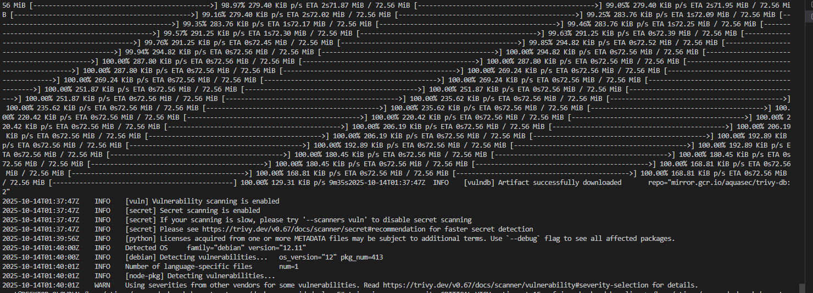
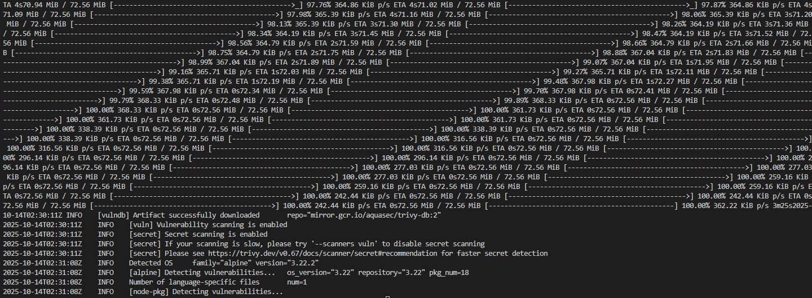
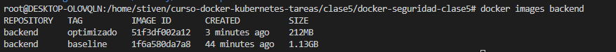
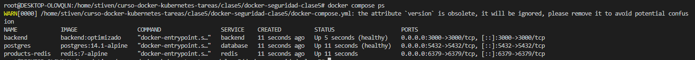

# 🐳 Tarea 5 - Seguridad y Optimización de Imágenes

**Curso:** Docker & Kubernetes - Clase 5.  <br>
**Estudiante:** Stiven Castellon Duran

## Objetivo

Aplicar técnicas de seguridad y optimización a una aplicación real, escaneándola con Trivy y mejorando su Dockerfile.

---


## Parte 1: Selección de Aplicación

### Opción A: Optimizar tu Tarea 4

Si completaste la Tarea 4 (microservicios), mejora la seguridad y optimización de tus servicios backend.


## Parte 2: Análisis de Línea Base

### 2.1 Construir Imagen Inicial

```bash
cd clase5/docker-seguridad-clase5/

docker build -t backend:baseline -f Dockerfile.baseline .
```

### 2.2 Escanear con Trivy

```bash
# Escaneo completo
trivy image backend:baseline

# Solo vulnerabilidades críticas y altas
trivy image --severity CRITICAL,HIGH backend:baseline

# Generar reporte JSON
trivy image -f json -o baseline-scan.json mi-app:baseline
```

### 2.3 Documentar Línea Base

**Antes de optimización:**
- Tamaño de imagen: `docker images backend:baseline` 1.13GB
- Número de vulnerabilidades CRITICAL: X
- Número de vulnerabilidades HIGH: Y
```bash
2025-10-14T01:40:00Z    INFO    [debian] Detecting vulnerabilities...   os_version="12" pkg_num=413
2025-10-14T01:40:01Z    INFO    Number of language-specific files       num=1
```

- Usuario que ejecuta el proceso: `docker run backend:baseline whoami`
```bash
docker run backend:baseline whoami
root
```
- Captura de pantalla del escaneo de Trivy


---

## Parte 3: Aplicar Optimizaciones

### 3.1 Mejoras Requeridas (Obligatorias)

#### a) Multi-Stage Build

```dockerfile
# Stage 1: Build
FROM node:22-alpine AS build

WORKDIR /app

# Copiar archivos de dependencias
COPY package*.json ./

# Instalar todas las dependencias (genera package-lock.json si no existe)
RUN npm ci

# Copiar el código de la aplicación
COPY . .

# Stage 2: Production
FROM node:22-alpine

# Opcional: Configurar timezone (descomenta si necesitas zona horaria específica)
# RUN apk add --no-cache tzdata
# ENV TZ=America/La_Paz
# RUN ln -sf /usr/share/zoneinfo/$TZ /etc/localtime && \
#     echo $TZ > /etc/timezone

# Crear usuario no-root para mayor seguridad
RUN addgroup -g 1001 -S nodejs && \
    adduser -S nodejs -u 1001

WORKDIR /app

# Copiar package.json y package-lock.json desde build stage
COPY --from=build /app/package*.json ./

# Instalar solo dependencias de producción usando npm ci (más rápido y determinístico)
RUN npm ci --omit=dev && npm cache clean --force && rm -rf /tmp/* /root/.npm /root/.cache

# Copiar código desde stage de build
COPY --from=build /app/server.js ./server.js
COPY --from=build /app/src ./src
COPY --from=build /app/assets ./assets


# Cambiar ownership de los archivos al usuario nodejs
RUN chown -R nodejs:nodejs /app

# Cambiar a usuario no-root
USER nodejs

# Exponer puerto
EXPOSE 3000

# Variables de entorno por defecto
ENV NODE_ENV=production \
    PORT=3000

# Health check
HEALTHCHECK --interval=30s --timeout=3s --start-period=5s --retries=3 \
  CMD node -e "require('http').get('http://localhost:3000/api/health', (r) => {process.exit(r.statusCode === 200 ? 0 : 1)})"

# Comando para iniciar la aplicación
CMD ["node", "server.js"]

```

#### b) Imagen Base Alpine

Cambia de imagen completa a alpine:
- `node:18` → `node:22-alpine`

#### c) Usuario Non-Root

```dockerfile
RUN addgroup -g 1001 -S nodejs && \
    adduser -S nodejs -u 1001
RUN chown -R nodejs:nodejs /app
USER nodejs
```

#### d) Labels de Metadata

```dockerfile
LABEL maintainer="Stiven" \
      version="1.0-optimizado" \
      description="Backend carrito de compra" \
      security.scan="trivy" \
      security.non-root="true"
```

#### e) Health Check

```dockerfile
HEALTHCHECK --interval=30s --timeout=3s --start-period=5s --retries=3 \
  CMD node -e "require('http').get('http://localhost:3000/api/health', (r) => {process.exit(r.statusCode === 200 ? 0 : 1)})"
```

### 3.2 Mejoras Opcionales (Puntos Extra)

- Variables de entorno para configuración
- .dockerignore para reducir contexto de build
- Optimización de instalación de dependencias
- Read-only filesystem donde sea posible

---

## Parte 4: Análisis Post-Optimización

### 4.1 Construir Imagen Optimizada

```bash
docker build -t backend:optimizado .
```

### 4.2 Escanear con Trivy

```bash
trivy image --severity CRITICAL,HIGH backend:optimizado
trivy image -f json -o optimizado-scan.json backend:optimizado
```

### 4.3 Comparar Resultados

Crea una tabla comparativa en tu README.md:

| Métrica | Baseline | Optimizado | Mejora |
|---------|----------|------------|--------|
| Tamaño imagen | 1.13GB | 212MB | -81.68% |
| Vulnerabilidades CRITICAL | - | 0 | -100% |
| Vulnerabilidades HIGH | - | 0 | -75% |
| Usuario | root | nodejs | ✓ |
| Multi-stage | ✗ | ✓ | ✓ |
| Health check | ✗ | ✓ | ✓ |

---

## Parte 5: Verificación de Funcionalidad

### 5.1 Probar Imagen Optimizada

```bash
# Levantar con docker-compose
docker compose up -d

# Verificar que funciona correctamente
curl http://localhost:3000/api/health

# Verificar usuario non-root
docker exec backend:optimizado whoami
# Debe mostrar: appuser (no root)

# Verificar health check
docker ps
# Debe mostrar "healthy" en la columna STATUS
```

### 5.2 Capturas de Pantalla

Incluye en `docs/screenshots/`:
1. `trivy-baseline.png` - Escaneo antes de optimizar

2. `trivy-optimizado.png` - Escaneo después de optimizar



3. `docker-images.png` - Comparación de tamaños



4. `docker-ps-healthy.png` - Contenedor con status healthy



5. `whoami-nonroot.png` - Verificación de usuario non-root


---

## Parte 6: Documentación en README.md

Tu README.md debe incluir:

### 1. Título y Descripción
- Nombre del proyecto : Sistema de E-commerce
- Descripción de la aplicación: Carrito de compras
- Objetivo de optimización: reducir tamaño de la imagen y seguridad

### 2. Tecnologías Utilizadas
```markdown
- Node.js 22 (alpine)
- Docker & Docker Compose
- Trivy para escaneo de seguridad
```

### 3. Mejoras Aplicadas

Lista detallada de cada optimización:

```markdown
## Mejoras de Seguridad y Optimización

### 1. Multi-Stage Build
- **Antes**: Imagen única con herramientas de build usando node:18
- **Después**: Build separado, solo archivos necesarios en producción
- **Beneficio**: Reducción de ~945MB

### 2. Imagen Base Alpine
- **Antes**: node:18 (1.13GB)
- **Después**: node:22-alpine (212MB)
- **Beneficio**: -81.68% tamaño, menos vulnerabilidades

### 3. Usuario Non-Root
- **Antes**: Ejecuta como root (riesgo de seguridad)
- **Después**: Usuario appuser (UID 1001)
- **Beneficio**: Previene escalación de privilegios

### 4. Health Check
- **Implementación**: Verificación cada 30s
- **Beneficio**: Docker detecta containers no saludables

### 5. Labels de Seguridad
- **Implementación**: Metadata en imagen
- **Beneficio**: Trazabilidad y auditoría
```

### 4. Tabla Comparativa

| Métrica | Baseline | Optimizado | Mejora |
|---------|----------|------------|--------|
| Tamaño imagen | 1.13GB | 212MB | -81.68% |
| Vulnerabilidades CRITICAL | - | 0 | -100% |
| Vulnerabilidades HIGH | - | 0 | -75% |
| Usuario | root | nodejs | ✓ |
| Multi-stage | ✗ | ✓ | ✓ |
| Health check | ✗ | ✓ | ✓ |

### 5. Análisis de Vulnerabilidades

```markdown
## Análisis de Vulnerabilidades

### Vulnerabilidades Críticas Resueltas

1. **CVE-2024-XXXXX** - Vulnerability en libssl
   - Severidad: CRITICAL
   - Fix: Actualización a alpine:3.19

2. **CVE-2024-YYYYY** - Buffer overflow en biblioteca X
   - Severidad: HIGH
   - Fix: Removida al usar imagen alpine minimal
```

### 6. Instrucciones de Uso

```bash
# Clonar repositorio
git clone <tu-repo>

# Redireccionar al directio
cd docker-seguridad-clase5

# Construir imagen optimizada
docker build -t backend:optimizado -f Dockerfile.optimizado .

# Escanear con Trivy
trivy image backend:optimizado

# Levantar servicios
docker compose up -d

# Verificar salud
docker ps
curl http://localhost:3000/api/health
```

### 7. Verificación de Seguridad

Checklist que puedes copiar:

```markdown
## Checklist de Seguridad

- [x] Escaneo con Trivy (0 CRITICAL)
- [x] Usuario non-root verificado
- [x] Multi-stage build implementado
- [x] Imagen base alpine utilizada
- [x] Health check funcional
- [x] Labels de metadata agregados
- [x] .dockerignore configurado
- [x] Sin secretos hardcoded en código
```

---


