# 🐳 Tarea 6 -Introducción a Kubernetes

**Curso:** Docker & Kubernetes - Clase 6.  <br>
**Estudiante:** Stiven Castellon Duran

Descripcion: El proposito fue desplegar un ningnx en kubernetes de forma declarativa,  a traves de un deployment y un service, se valido el estado del pod, se expuso el pod para acceder desde la maquina local y se libero el pod al finalizar la prueba.

## Stack

- **Aplicación:** Nginx 
- **Kubernetes:** minikube
- **Réplicas:** 3

## Ejecución

1. Clonar:
   ```bash
  https://github.com/stivencd/curso-docker-kubernetes-tareas
   cd clase6

2. Desplegar:

```bash
kubectl apply -f deployment.yaml
kubectl apply -f service.yaml
```

3. Acceder:
http://127.0.0.1:51741/
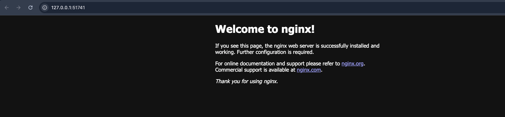


### 4. Cómo Probar

```markdown
## Verificación

1. Ver recursos:
   ```bash
   kubectl get all
```
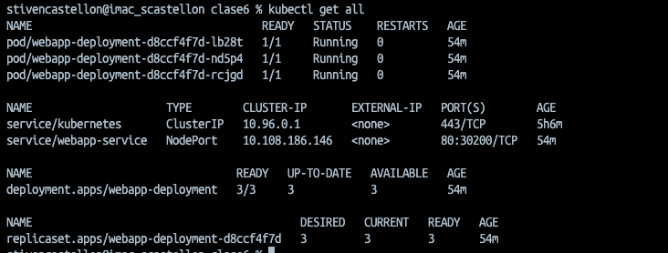

2. Acceder a la web: http://127.0.0.1:51741/


3. Escalar:
```markdown
kubectl scale deployment webapp-deployment --replicas=5
kubectl get pods
```


### 5. Capturas de Pantalla

### Recursos desplegados
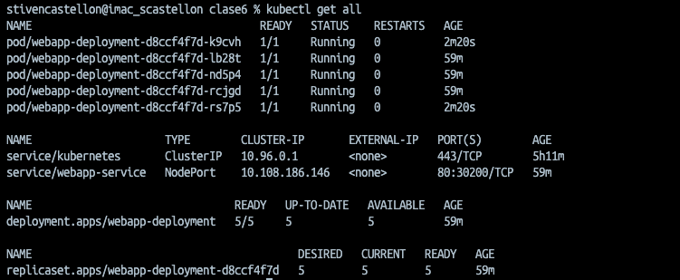

### Aplicación funcionando


### Escalado a 5 réplicas
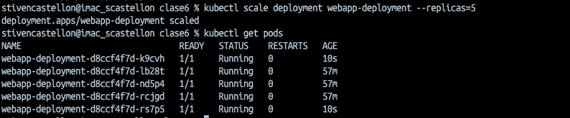


6. Conceptos Aplicados

## Conceptos Kubernetes

- Deployment con 3 réplicas
- Service tipo NodePort
- Labels y selectors
- Auto-healing
- Escalado horizontal


# Parte 7: Capturas de Pantalla

- Recursos desplegados: kubectl get all mostrando deployment, pods y service


- Pods detallados: kubectl get pods -o wide con las 3 réplicas running

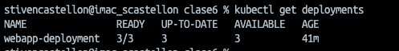

- Aplicación funcionando: Navegador accediendo a http://IP:30200

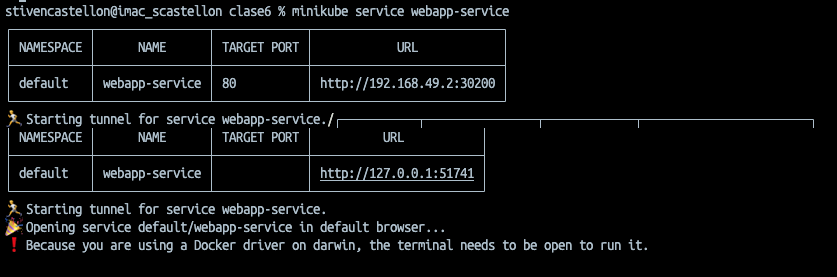


- Escalado: kubectl get pods después de escalar a 5 réplicas


- kubectl describe deployment webapp-deployment


- Auto-healing después de eliminar un pod

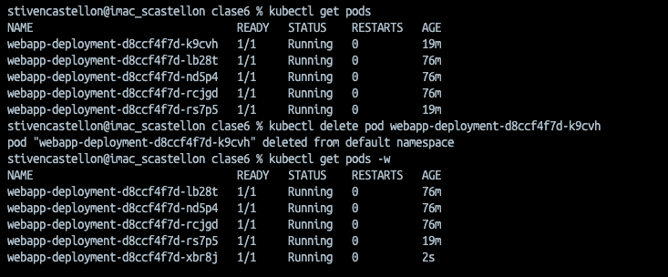

- Logs de uno de los pods

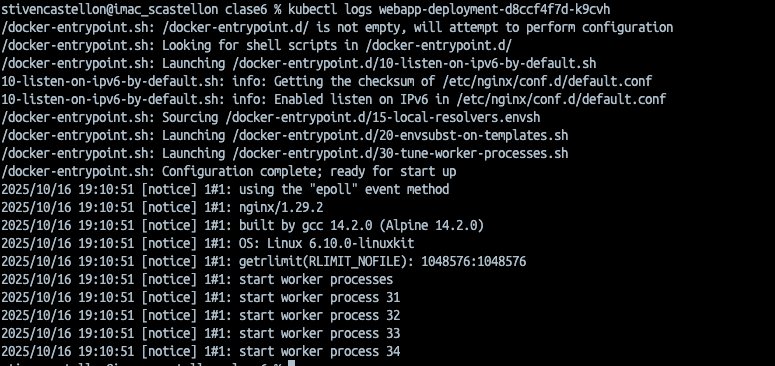


# Desafíos Opcionales (Puntos Extra)

Bonus 1: Labels adicionales (5 puntos)
Agrega más labels útiles al deployment:

```markdown
  labels:
    app: webapp
    env: homework
    version: 1.0
    tier: frontend
```
Bonus 2: Rolling Update (10 puntos)
Actualiza la imagen a nginx:1.26-alpine y documenta:
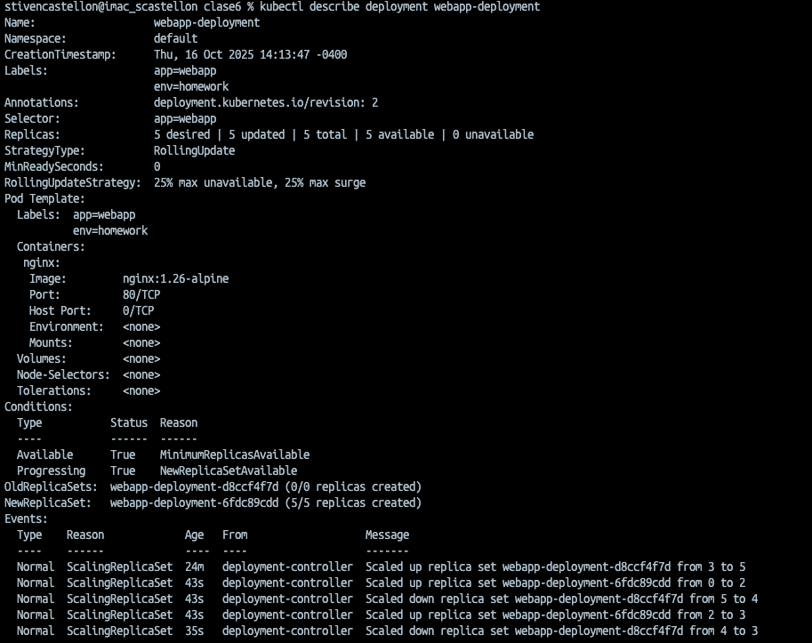

```markdown
kubectl rollout status deployment webapp-deployment
deployment "webapp-deployment" successfully rolled out


kubectl rollout history deployment webapp-deployment
deployment.apps/webapp-deployment 
REVISION  CHANGE-CAUSE
1         <none>
2         <none>
```

Bonus 3: Usar tu propia imagen 

```makdown
#Dockerfile

FROM python:3.12-alpine AS builder

WORKDIR /app

# Copiar requirements
COPY requirements.txt .

# Evitar generar los archivos bytecode 
ENV PYTHONDONTWRITEBYTECODE=1
ENV PYTHONUNBUFFERED=1

#Instalar dependencias y no almacenar en cache las depencias
RUN python -m venv /opt/venv && /opt/venv/bin/pip install --no-cache-dir -r requirements.txt


FROM python:3.12-alpine
RUN addgroup -g 1001 -S python && adduser -S python -u 1001
# Copiar los binarios del anterior stage
COPY --from=builder /opt/venv /opt/venv
WORKDIR /app
COPY . .
#Variable de entorno
ENV APP_PORT=5000
ENV FLASK_ENV=production

# Activar el entorno virtual
ENV PATH="/opt/venv/bin:$PATH"

RUN chown -R python:python /app
USER python

# Exponer el puerto del contenedor
EXPOSE ${APP_PORT}

HEALTHCHECK --interval=30s --timeout=5s --start-period=10s --retries=3 \
 CMD wget -qO- http://localhost:5000/api/users/status || exit 1

#CMD ["python", "run.py"]
CMD ["gunicorn", "--bind", "0.0.0.0:5000", "run:app"]

```

```bash
#pasos
kubectl apply -f namespace.yaml
kubectl apply -f deployment-apirest.yaml
kubectl apply -f service-apirest.yaml
kubectl port-forward svc/apirest-service 5000:80 -n tarea-clase6
```
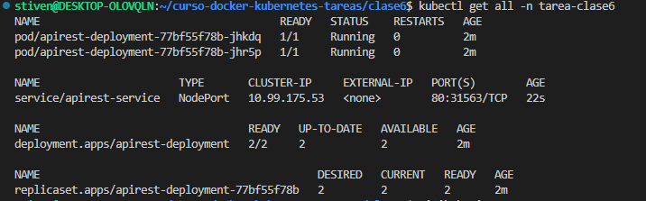

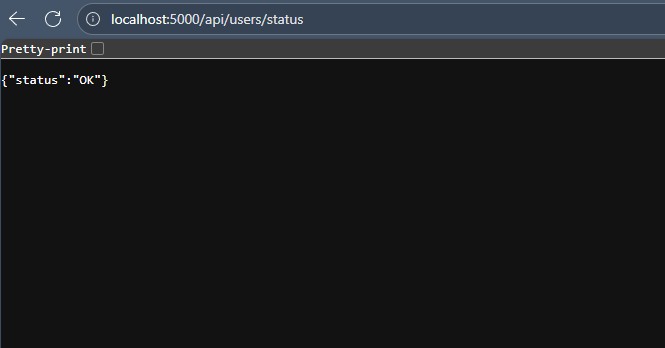

# Limpieza
Al terminar de trabajar en la tarea:
# Eliminar recursos
kubectl delete -f deployment.yaml

kubectl delete -f service.yaml

# Verificar que se eliminaron
kubectl get all

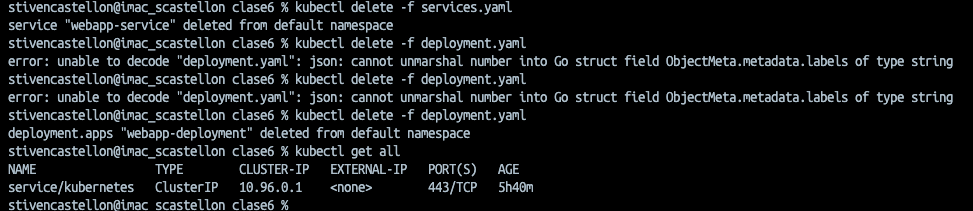
