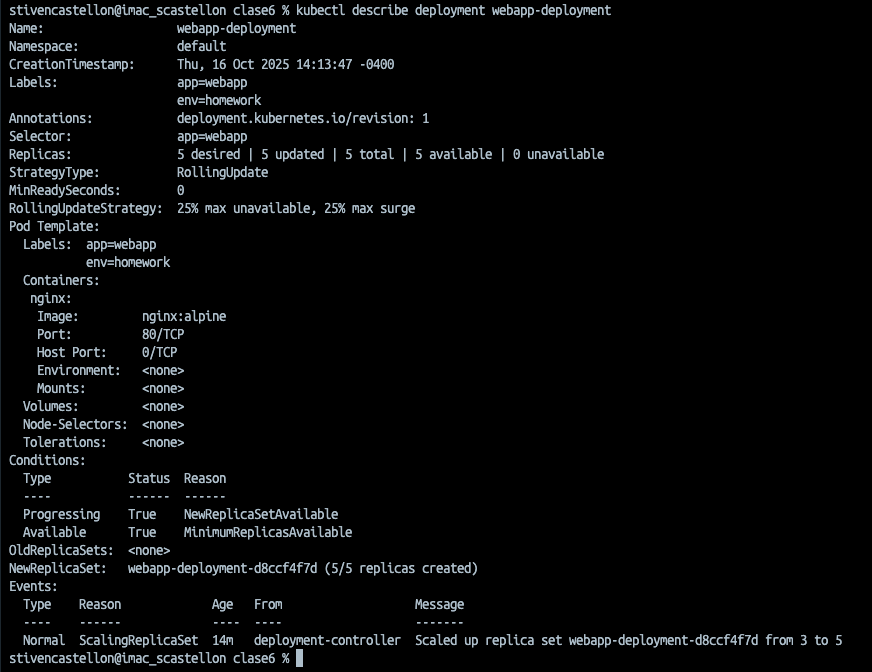

# 🐳 Tarea 6 -Introducción a Kubernetes

**Curso:** Docker & Kubernetes - Clase 6.  <br>
**Estudiante:** Stiven Castellon Duran

Descripcion: El proposito fue desplegar un ningnx en kubernetes de forma declarativa,  a traves de un deployment y un service, se valido el estado del pod, se expuso el pod para acceder desde la maquina local y se libero el pod al finalizar la prueba.

## Stack

- **Aplicación:** Nginx 
- **Kubernetes:** minikube
- **Réplicas:** 3

## Ejecución

1. Clonar:
   ```bash
   git clone https://github.com/tu-usuario/tu-repo.git
   cd tu-repo

2. Desplegar:

```bash
kubectl apply -f deployment.yaml
kubectl apply -f service.yaml
```

3. Acceder:
http://127.0.0.1:51741/


### 4. Cómo Probar

```markdown
## Verificación

1. Ver recursos:
   ```bash
   kubectl get all
```


2. Acceder a la web: http://127.0.0.1:51741/


3. Escalar:
```markdown
kubectl scale deployment webapp-deployment --replicas=5
kubectl get pods
```


### 5. Capturas de Pantalla

### Recursos desplegados


### Aplicación funcionando


### Escalado a 5 réplicas


6. Conceptos Aplicados

## Conceptos Kubernetes

- Deployment con 3 réplicas
- Service tipo NodePort
- Labels y selectors
- Auto-healing
- Escalado horizontal


# Parte 7: Capturas de Pantalla

- Recursos desplegados: kubectl get all mostrando deployment, pods y service


- Pods detallados: kubectl get pods -o wide con las 3 réplicas running


- Aplicación funcionando: Navegador accediendo a http://IP:30200


- Escalado: kubectl get pods después de escalar a 5 réplicas


- kubectl describe deployment webapp-deployment



- Auto-healing después de eliminar un pod


- Logs de uno de los pods


# Desafíos Opcionales (Puntos Extra)

Bonus 1: Labels adicionales (5 puntos)
Agrega más labels útiles al deployment:

```markdown
  labels:
    app: webapp
    env: homework
    version: 1.0
    tier: frontend
```
Bonus 2: Rolling Update (10 puntos)
Actualiza la imagen a nginx:1.26-alpine y documenta:


```markdown
kubectl rollout status deployment webapp-deployment
deployment "webapp-deployment" successfully rolled out


kubectl rollout history deployment webapp-deployment
deployment.apps/webapp-deployment 
REVISION  CHANGE-CAUSE
1         <none>
2         <none>
```

Bonus 3: Usar tu propia imagen 

# Limpieza
Al terminar de trabajar en la tarea:
# Eliminar recursos
kubectl delete -f deployment.yaml

kubectl delete -f service.yaml

# Verificar que se eliminaron
kubectl get all


