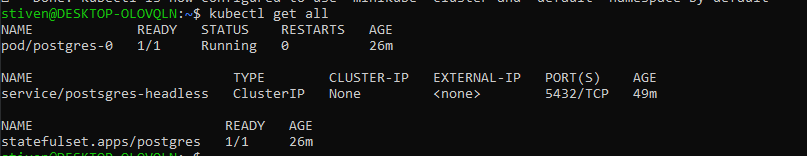
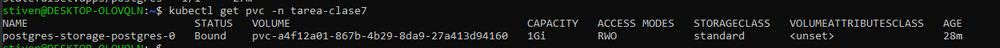
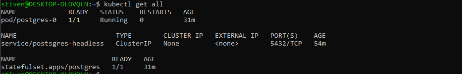
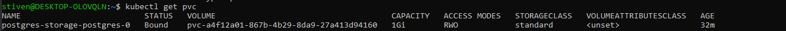
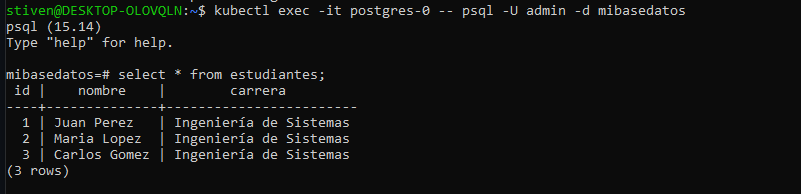
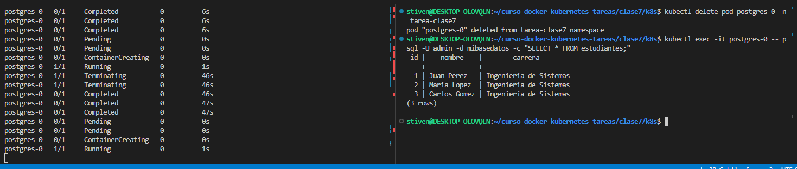
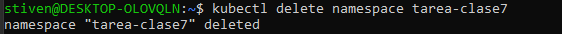
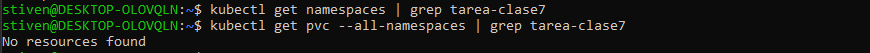

# ☸️ Tarea 7 -Namespaces, Configuración y Persistencia

**Curso:** Docker & Kubernetes - Clase 7.  <br>
**Estudiante:** Stiven Castellon Duran

**a) Descripción:**
- Objetivo de la tarea: se aplico los concepto en clase, creacion de namespace configmap, secret, statefulset y  pvc de forma declarativa

**b) Instrucciones paso a paso:**
1. Crear namespace  ✅
2. Aplicar ConfigMap ✅
3. Aplicar Secret ✅
4. Aplicar Headless Service ✅
5. Aplicar StatefulSet ✅
6. Verificar que todo está corriendo ✅
7. Probar PostgreSQL ✅
8. Demostrar persistencia ✅

**c) Comandos de verificación:**
```bash
kubectl get all -n tarea-clase7
```

```bash
```


```bash
kubectl get configmap,secret -n tarea-clase7
```
](screenshots/kubectl-get-configmap-secret.png)

**d) Capturas de pantalla:**

1. `kubectl get all` mostrando todos los recursos


2. `kubectl get pvc` mostrando el volumen BOUND



3. Datos en PostgreSQL (SELECT)



4. Prueba de persistencia (después de eliminar pod)



**e) Comandos de limpieza:**

```bash
kubectl delete namespace tarea-clase7
# Esto elimina todo: pods, services, configmaps, secrets, pvcs
```
--- 

## Parte 8: Limpieza (5 puntos)

### 8.1 Eliminar todos los recursos

```bash
kubectl delete namespace tarea-clase7
```


### 8.2 Verificar

```bash
kubectl get namespaces | grep tarea-clase7
kubectl get pvc --all-namespaces | grep tarea-clase7
```

