# ☸️ Tarea 8 - Ingress, Health Probes y Escalado Automático

**Curso:** Docker & Kubernetes - Clase 8.  <br>
**Estudiante:** Stiven Castellon Duran

**a) Descripción:**
- Objetivo de la tarea: se aplico los concepto en clase, creacion de namespace configmap, secret, statefulset y  pvc de forma declarativa


**a) Descripción del proyecto:**
- Stack desplegado (frontend + backend) Se creo los deployments / service frontend y un backend  de forma descriptiva utilizando nginx como imagen
- Conceptos aplicados (Ingress, health probes, HPA). Se creo los concepto aplicados en clase para validar el estado del contendor 

**b) Instrucciones de despliegue:**
1. Habilitar addons (ingress, metrics-server)
Habilitando ingress en minikube 
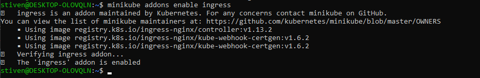
Habilitando metric-server en minikube 
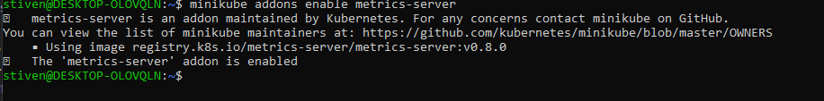
2. Aplicar manifests
```bash
kubectl apply -f k8s/backend-deployment.yaml
kubectl apply -f k8s/frontend-deployment.yaml
kubectl apply -f k8s/backend-service.yaml
kubectl apply -f k8s/frontend-service.yaml
kubectl apply -f k8s/hpa.yaml
kubectl apply -f k8s/ingress.yaml
```
3. Verificar recursos
4. Probar Ingress
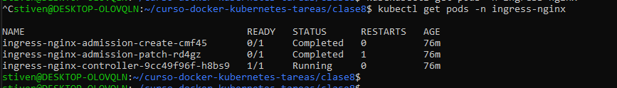

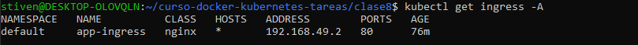

5. Probar HPA con carga

Validar metric-server
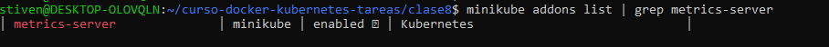

Validar estado habilitado
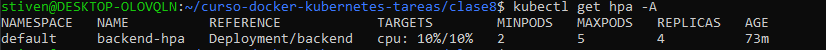

Validar pods
[text](screenshots/02-hpa-test3png)

**c) Comandos de verificación:**
```bash
kubectl get all
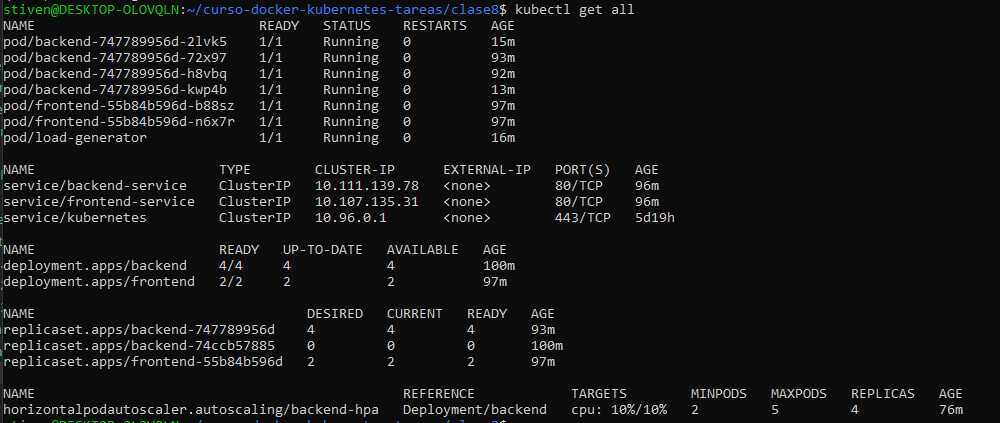

kubectl get ingress
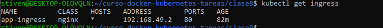

kubectl get hpa
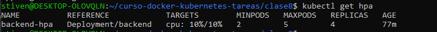

kubectl top pods
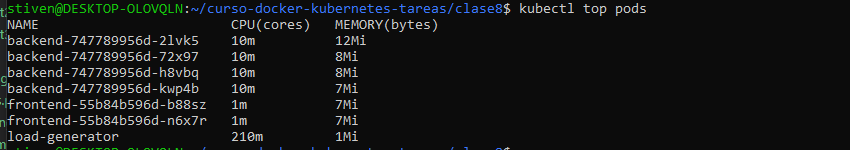

```

**d) Capturas de pantalla:**
1. Ingress funcionando (curl a `/` y `/api`)

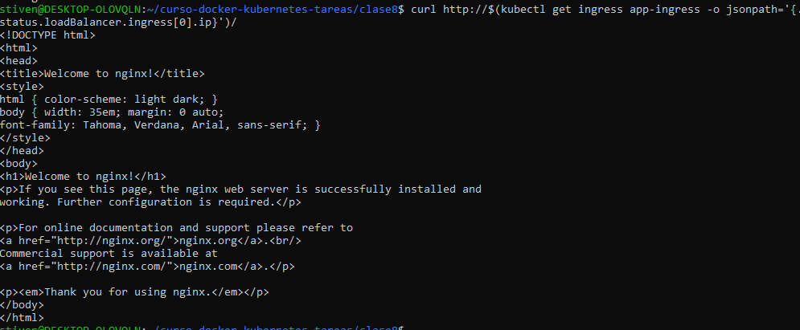

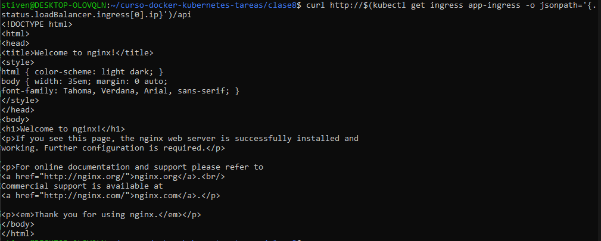

2. Health probes configurados (`kubectl describe pod`)

```bash
stiven@DESKTOP-OLOVQLN:~/curso-docker-kubernetes-tareas/clase8$ kubectl describe pod
Name:             backend-747789956d-2lvk5
Namespace:        default
Priority:         0
Service Account:  default
Node:             minikube/192.168.49.2
Start Time:       Sun, 19 Oct 2025 19:39:35 -0300
Labels:           app=backend
                  pod-template-hash=747789956d
Annotations:      <none>
Status:           Running
IP:               10.244.0.74
IPs:
  IP:           10.244.0.74
Controlled By:  ReplicaSet/backend-747789956d
Containers:
  nginx:
    Container ID:   docker://67c9927b9b87886d5f77f3500724e6467062db95ab96aec5bc42b3bc1964218a
    Image:          nginx:alpine
    Image ID:       docker-pullable://nginx@sha256:61e01287e546aac28a3f56839c136b31f590273f3b41187a36f46f6a03bbfe22
    Port:           80/TCP
    Host Port:      0/TCP
    State:          Running
      Started:      Sun, 19 Oct 2025 19:39:37 -0300
    Ready:          True
    Restart Count:  0
    Limits:
      cpu:     200m
      memory:  256Mi
    Requests:
      cpu:        100m
      memory:     128Mi
    Liveness:     http-get http://:80/ delay=5s timeout=1s period=5s #success=1 #failure=3
    Readiness:    http-get http://:80/ delay=3s timeout=1s period=3s #success=1 #failure=3
    Environment:  <none>
    Mounts:
      /var/run/secrets/kubernetes.io/serviceaccount from kube-api-access-bm79w (ro)
Conditions:
  Type                        Status
  PodReadyToStartContainers   True
  Initialized                 True
  Ready                       True
  ContainersReady             True
  PodScheduled                True
Volumes:
  kube-api-access-bm79w:
    Type:                    Projected (a volume that contains injected data from multiple sources)
    TokenExpirationSeconds:  3607
    ConfigMapName:           kube-root-ca.crt
    Optional:                false
    DownwardAPI:             true
QoS Class:                   Burstable
Node-Selectors:              <none>
Tolerations:                 node.kubernetes.io/not-ready:NoExecute op=Exists for 300s
                             node.kubernetes.io/unreachable:NoExecute op=Exists for 300s
Events:                      <none>


Name:             backend-747789956d-72x97
Namespace:        default
Priority:         0
Service Account:  default
Node:             minikube/192.168.49.2
Start Time:       Sun, 19 Oct 2025 18:21:48 -0300
Labels:           app=backend
                  pod-template-hash=747789956d
Annotations:      <none>
Status:           Running
IP:               10.244.0.66
IPs:
  IP:           10.244.0.66
Controlled By:  ReplicaSet/backend-747789956d
Containers:
  nginx:
    Container ID:   docker://379fd9f08fd1e9cf251444c73110f66aa6db48a0c05fa0420749422490649fcf
    Image:          nginx:alpine
    Image ID:       docker-pullable://nginx@sha256:61e01287e546aac28a3f56839c136b31f590273f3b41187a36f46f6a03bbfe22
    Port:           80/TCP
    Host Port:      0/TCP
    State:          Running
      Started:      Sun, 19 Oct 2025 18:21:49 -0300
    Ready:          True
    Restart Count:  0
    Limits:
      cpu:     200m
      memory:  256Mi
    Requests:
      cpu:        100m
      memory:     128Mi
    Liveness:     http-get http://:80/ delay=5s timeout=1s period=5s #success=1 #failure=3
    Readiness:    http-get http://:80/ delay=3s timeout=1s period=3s #success=1 #failure=3
    Environment:  <none>
    Mounts:
      /var/run/secrets/kubernetes.io/serviceaccount from kube-api-access-h9bfl (ro)
Conditions:
  Type                        Status
  PodReadyToStartContainers   True
  Initialized                 True
  Ready                       True
  ContainersReady             True
  PodScheduled                True
Volumes:
  kube-api-access-h9bfl:
    Type:                    Projected (a volume that contains injected data from multiple sources)
    TokenExpirationSeconds:  3607
    ConfigMapName:           kube-root-ca.crt
    Optional:                false
    DownwardAPI:             true
QoS Class:                   Burstable
Node-Selectors:              <none>
Tolerations:                 node.kubernetes.io/not-ready:NoExecute op=Exists for 300s
                             node.kubernetes.io/unreachable:NoExecute op=Exists for 300s
Events:                      <none>


Name:             backend-747789956d-h8vbq
Namespace:        default
Priority:         0
Service Account:  default
Node:             minikube/192.168.49.2
Start Time:       Sun, 19 Oct 2025 18:21:54 -0300
Labels:           app=backend
                  pod-template-hash=747789956d
Annotations:      <none>
Status:           Running
IP:               10.244.0.67
IPs:
  IP:           10.244.0.67
Controlled By:  ReplicaSet/backend-747789956d
Containers:
  nginx:
    Container ID:   docker://a6baf90fee709752e35de89ce1bc254969826ae50e7d5f38c7ff5b7d4511f8c2
    Image:          nginx:alpine
    Image ID:       docker-pullable://nginx@sha256:61e01287e546aac28a3f56839c136b31f590273f3b41187a36f46f6a03bbfe22
    Port:           80/TCP
    Host Port:      0/TCP
    State:          Running
      Started:      Sun, 19 Oct 2025 18:21:55 -0300
    Ready:          True
    Restart Count:  0
    Limits:
      cpu:     200m
      memory:  256Mi
    Requests:
      cpu:        100m
      memory:     128Mi
    Liveness:     http-get http://:80/ delay=5s timeout=1s period=5s #success=1 #failure=3
    Readiness:    http-get http://:80/ delay=3s timeout=1s period=3s #success=1 #failure=3
    Environment:  <none>
    Mounts:
      /var/run/secrets/kubernetes.io/serviceaccount from kube-api-access-jplfr (ro)
Conditions:
  Type                        Status
  PodReadyToStartContainers   True
  Initialized                 True
  Ready                       True
  ContainersReady             True
  PodScheduled                True
Volumes:
  kube-api-access-jplfr:
    Type:                    Projected (a volume that contains injected data from multiple sources)
    TokenExpirationSeconds:  3607
    ConfigMapName:           kube-root-ca.crt
    Optional:                false
    DownwardAPI:             true
QoS Class:                   Burstable
Node-Selectors:              <none>
Tolerations:                 node.kubernetes.io/not-ready:NoExecute op=Exists for 300s
                             node.kubernetes.io/unreachable:NoExecute op=Exists for 300s
Events:                      <none>


Name:             backend-747789956d-kwp4b
Namespace:        default
Priority:         0
Service Account:  default
Node:             minikube/192.168.49.2
Start Time:       Sun, 19 Oct 2025 19:41:44 -0300
Labels:           app=backend
                  pod-template-hash=747789956d
Annotations:      <none>
Status:           Running
IP:               10.244.0.75
IPs:
  IP:           10.244.0.75
Controlled By:  ReplicaSet/backend-747789956d
Containers:
  nginx:
    Container ID:   docker://5d84c13c6387c02dc42f54a46a83ab6773a19119cf3564f9aa69c7d1e530f2e4
    Image:          nginx:alpine
    Image ID:       docker-pullable://nginx@sha256:61e01287e546aac28a3f56839c136b31f590273f3b41187a36f46f6a03bbfe22
    Port:           80/TCP
    Host Port:      0/TCP
    State:          Running
      Started:      Sun, 19 Oct 2025 19:41:50 -0300
    Ready:          True
    Restart Count:  0
    Limits:
      cpu:     200m
      memory:  256Mi
    Requests:
      cpu:        100m
      memory:     128Mi
    Liveness:     http-get http://:80/ delay=5s timeout=1s period=5s #success=1 #failure=3
    Readiness:    http-get http://:80/ delay=3s timeout=1s period=3s #success=1 #failure=3
    Environment:  <none>
    Mounts:
      /var/run/secrets/kubernetes.io/serviceaccount from kube-api-access-wj4ws (ro)
Conditions:
  Type                        Status
  PodReadyToStartContainers   True
  Initialized                 True
  Ready                       True
  ContainersReady             True
  PodScheduled                True
Volumes:
  kube-api-access-wj4ws:
    Type:                    Projected (a volume that contains injected data from multiple sources)
    TokenExpirationSeconds:  3607
    ConfigMapName:           kube-root-ca.crt
    Optional:                false
    DownwardAPI:             true
QoS Class:                   Burstable
Node-Selectors:              <none>
Tolerations:                 node.kubernetes.io/not-ready:NoExecute op=Exists for 300s
                             node.kubernetes.io/unreachable:NoExecute op=Exists for 300s
Events:                      <none>


Name:             frontend-55b84b596d-b88sz
Namespace:        default
Priority:         0
Service Account:  default
Node:             minikube/192.168.49.2
Start Time:       Sun, 19 Oct 2025 18:17:20 -0300
Labels:           app=frontend
                  pod-template-hash=55b84b596d
Annotations:      <none>
Status:           Running
IP:               10.244.0.64
IPs:
  IP:           10.244.0.64
Controlled By:  ReplicaSet/frontend-55b84b596d
Containers:
  nginx:
    Container ID:   docker://a0b1d56def385a8846a7ef46c89a3e1e3ebd7721e22f62fbe84c8ccdfef863fd
    Image:          nginx:alpine
    Image ID:       docker-pullable://nginx@sha256:61e01287e546aac28a3f56839c136b31f590273f3b41187a36f46f6a03bbfe22
    Port:           80/TCP
    Host Port:      0/TCP
    State:          Running
      Started:      Sun, 19 Oct 2025 18:17:24 -0300
    Ready:          True
    Restart Count:  0
    Liveness:       http-get http://:80/ delay=5s timeout=1s period=5s #success=1 #failure=3
    Readiness:      http-get http://:80/ delay=3s timeout=1s period=3s #success=1 #failure=3
    Environment:    <none>
    Mounts:
      /var/run/secrets/kubernetes.io/serviceaccount from kube-api-access-4rd5b (ro)
Conditions:
  Type                        Status
  PodReadyToStartContainers   True
  Initialized                 True
  Ready                       True
  ContainersReady             True
  PodScheduled                True
Volumes:
  kube-api-access-4rd5b:
    Type:                    Projected (a volume that contains injected data from multiple sources)
    TokenExpirationSeconds:  3607
    ConfigMapName:           kube-root-ca.crt
    Optional:                false
    DownwardAPI:             true
QoS Class:                   BestEffort
Node-Selectors:              <none>
Tolerations:                 node.kubernetes.io/not-ready:NoExecute op=Exists for 300s
                             node.kubernetes.io/unreachable:NoExecute op=Exists for 300s
Events:                      <none>


Name:             frontend-55b84b596d-n6x7r
Namespace:        default
Priority:         0
Service Account:  default
Node:             minikube/192.168.49.2
Start Time:       Sun, 19 Oct 2025 18:17:20 -0300
Labels:           app=frontend
                  pod-template-hash=55b84b596d
Annotations:      <none>
Status:           Running
IP:               10.244.0.65
IPs:
  IP:           10.244.0.65
Controlled By:  ReplicaSet/frontend-55b84b596d
Containers:
  nginx:
    Container ID:   docker://d59ce82f195e14e8cbf390ae7aed8f6d18d920276bd6f57bb36559e271d06a0b
    Image:          nginx:alpine
    Image ID:       docker-pullable://nginx@sha256:61e01287e546aac28a3f56839c136b31f590273f3b41187a36f46f6a03bbfe22
    Port:           80/TCP
    Host Port:      0/TCP
    State:          Running
      Started:      Sun, 19 Oct 2025 18:17:24 -0300
    Ready:          True
    Restart Count:  0
    Liveness:       http-get http://:80/ delay=5s timeout=1s period=5s #success=1 #failure=3
    Readiness:      http-get http://:80/ delay=3s timeout=1s period=3s #success=1 #failure=3
    Environment:    <none>
    Mounts:
      /var/run/secrets/kubernetes.io/serviceaccount from kube-api-access-lhwvv (ro)
Conditions:
  Type                        Status
  PodReadyToStartContainers   True
  Initialized                 True
  Ready                       True
  ContainersReady             True
  PodScheduled                True
Volumes:
  kube-api-access-lhwvv:
    Type:                    Projected (a volume that contains injected data from multiple sources)
    TokenExpirationSeconds:  3607
    ConfigMapName:           kube-root-ca.crt
    Optional:                false
    DownwardAPI:             true
QoS Class:                   BestEffort
Node-Selectors:              <none>
Tolerations:                 node.kubernetes.io/not-ready:NoExecute op=Exists for 300s
                             node.kubernetes.io/unreachable:NoExecute op=Exists for 300s
Events:                      <none>


Name:             load-generator
Namespace:        default
Priority:         0
Service Account:  default
Node:             minikube/192.168.49.2
Start Time:       Sun, 19 Oct 2025 19:38:37 -0300
Labels:           run=load-generator
Annotations:      <none>
Status:           Running
IP:               10.244.0.73
IPs:
  IP:  10.244.0.73
Containers:
  load-generator:
    Container ID:  docker://308292cc4f1d55e45a10e25f9b9333db1604b72fb13a5fb19ea1d722517dd05b
    Image:         busybox:1.28
    Image ID:      docker-pullable://busybox@sha256:141c253bc4c3fd0a201d32dc1f493bcf3fff003b6df416dea4f41046e0f37d47
    Port:          <none>
    Host Port:     <none>
    Args:
      /bin/sh
      -c
      while sleep 0.01; do wget  -qO- http://backend-service; done
    State:          Running
      Started:      Sun, 19 Oct 2025 19:38:38 -0300
    Ready:          True
    Restart Count:  0
    Environment:    <none>
    Mounts:
      /var/run/secrets/kubernetes.io/serviceaccount from kube-api-access-4d6nh (ro)
Conditions:
  Type                        Status
  PodReadyToStartContainers   True
  Initialized                 True
  Ready                       True
  ContainersReady             True
  PodScheduled                True
Volumes:
  kube-api-access-4d6nh:
    Type:                    Projected (a volume that contains injected data from multiple sources)
    TokenExpirationSeconds:  3607
    ConfigMapName:           kube-root-ca.crt
    Optional:                false
    DownwardAPI:             true
QoS Class:                   BestEffort
Node-Selectors:              <none>
Tolerations:                 node.kubernetes.io/not-ready:NoExecute op=Exists for 300s
                             node.kubernetes.io/unreachable:NoExecute op=Exists for 300s
Events:                      <none>
```

3. HPA en reposo (TARGETS 0%/50%)

0% de uso de CPU por pods
50% uso maximo de CPU

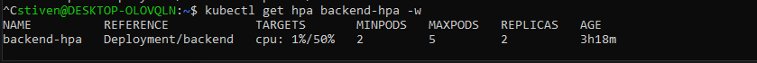

4. HPA escalando bajo carga (TARGETS >50%)

Con el incremento de CPU en el pod la replica aumento de 2 a 3
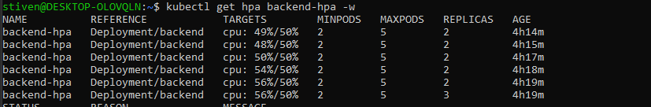

5. Pods escalados (de 2 a 4-5)

Con el cambio en HPA de un minimo de 2 a 4 replicas el consumo de CPU se redujo.
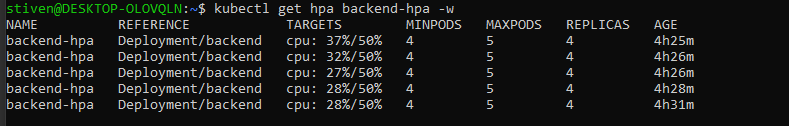

**e) Comandos de limpieza:**
```bash
kubectl delete ingress app-ingress
kubectl delete hpa backend-hpa
kubectl delete service frontend-service backend-service
kubectl delete deployment frontend backend
```

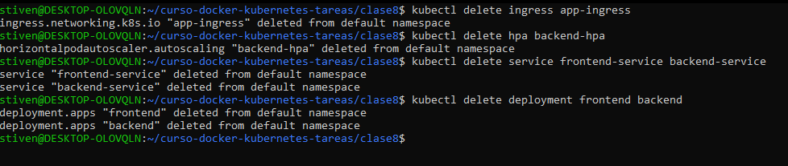

---