  # Proyecto Final - Docker & Kubernetes

   **Alumno:** Stiven Castellon Duran <br>
   **Fecha:** 22/10/2025 <br>
   **Curso:** Docker & Kubernetes - i-Quattro <br>

## Links de Docker Hub
- Backend v2.1: https://hub.docker.com/r/tu-usuario/springboot-api/tags
- Frontend v2.2: https://hub.docker.com/r/tu-usuario/angular-frontend/tags

## Parte 1: Setup del Ambiente

**Ambiente utilizado:**
   - VirutalBox 
   - Nombre de VM/Instancia: [stiven-castellon-k8s]
   - Sistema operativo: Ubuntu 24.04.3 LTS (Noble Numbat)
   - Recursos:
 | H/W path     | Device   | Class      | Description                          |
 |---------------|-----------|------------|--------------------------------------|
 |               |           | system     | Computer                             |
 | /0            |           | bus        | Motherboard                          |
 | /0/1          |           | memory     | 4 GiB System memory                  |
 | /0/2          |           | processor  | Intel(R) Core(TM) i7 CPU 860 @ 2.80 GHz |
 | /0/3          |           | generic    | Virtio file system                   |
 | /0/3/0        |           | generic    | Virtual I/O device                   |
 | /0/4          |           | display    | Basic Render Driver                  |
 | /0/0          |           | storage    | Virtio 1.0 console                   |
 | /0/0/0        |           | generic    | Virtual I/O device                   |
 | /0/5          |           | system     | PnP device PNP0b00                   |
 | /0/6          | scsi0     | storage    |                                      |
 | /0/6/0.0.0    | /dev/sda  | volume     | 388 MiB Virtual Disk                 |
 | /0/6/0.0.1    | /dev/sdb  | volume     | 1 GiB Virtual Disk                   |
 | /0/6/0.0.2    | /dev/sdc  | volume     | 1 TiB Virtual Disk                   |
 | /0/6/0.0.3    | /dev/sdd  | volume     | 1 TiB Virtual Disk                   |
 | /1            | usb1      | bus        | USB/IP Virtual Host Controller       |
 | /2            | usb2      | bus        | USB/IP Virtual Host Controller       |
 | /3            | eth0      | network    | Ethernet interface                   |

#### 1.2 Instalar microk8s

   - Rango MetalLB:
```bash
microk8s kubectl get ipaddresspool default-addresspool -n metallb-system -o jsonpath='{.spec.addresses[0]}'
172.30.197.190-172.30.197.200
```

```bash
microk8s status
```
   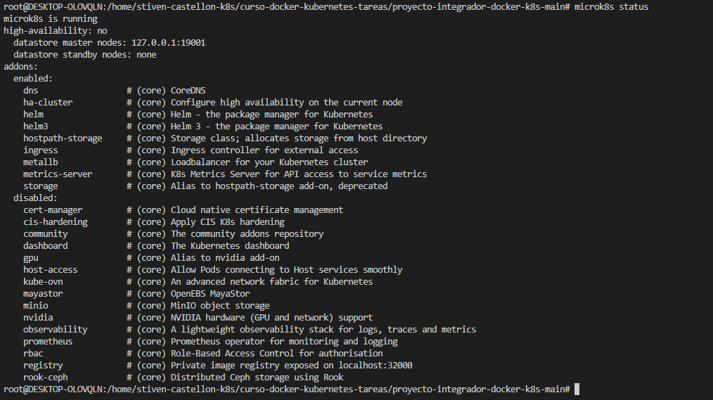
   
```bash
microk8s kubectl get pods -A
```
   

#### 1.3 Habilitar Addons

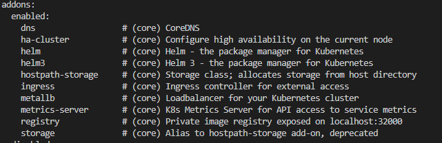


Exponiendo la IPAddress del frontend a traves de MetalLB
```bash
microk8s kubectl expose deployment frontend --port=80 --target-port=80 --type=LoadBalancer -n proyecto-integrador
```
Resultado:


Exponiendo la IPAddress del backend a traves de MetalLB

```bash
microk8s kubectl expose deployment api --port=8080 --target-port=8080 --type=LoadBalancer -n proyecto-integrador
```
Resultado:


#### 1.4 Instalar Git y Docker
Instalando Docker/git

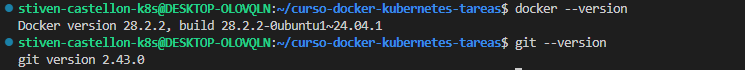

---

## Parte 2: Iteración v2.1 

### Objetivo
Agregar un nuevo endpoint en el backend, versionar la imagen como v2.1, publicarla en tu Docker Hub y actualizar el deployment.

#### 2.1 Agregar Nuevo Endpoint

Captura del nuevo enpoint agregado:


#### 2.2 Build Imagen Docker v2.1

Captura de las images creadas con el tag: v2.1:

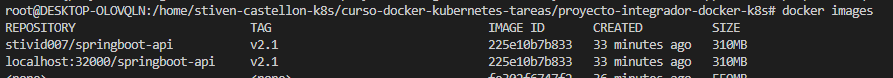

```bash
# Verificar imagen
docker images | grep springboot-api
```
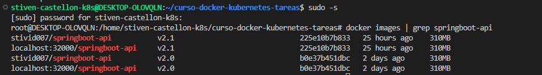

#### 2.3 Push a Microk8s registry

Las images fueron creadas en microk8s registry


#### 2.4 Actualizar Deployment de Kubernetes

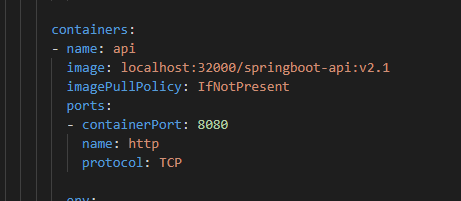

#### 2.5 Aplicar Cambios
Estado del rollout aplicado al deployment:


Describe del pod:

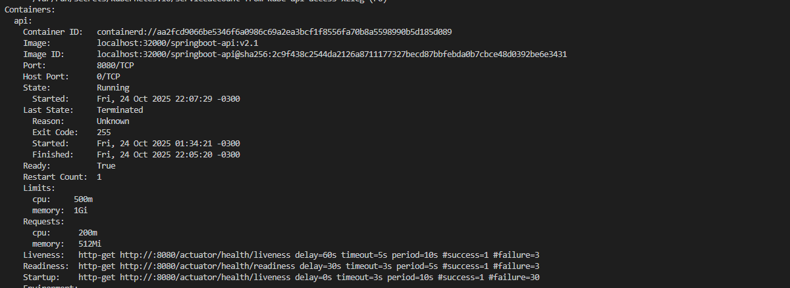

Verificando los Pods


Captura del CURL al nuevo endopoint, se cambio la ruta porque ya existia uno definido en el codigo, para evitar error de ambiguedad al iniciar la aplicacion se cambio el endpoint

#### 2.6 Verificar Funcionamiento

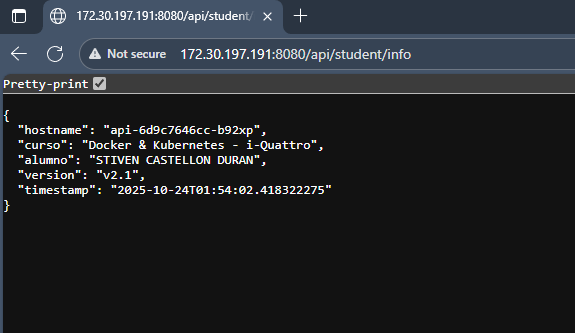

---

## Parte 3: Iteración v2.2 - 

#### 3.1 Modificar Frontend Angular

Modificando en el HTML: frontend/src/app/app.component.html

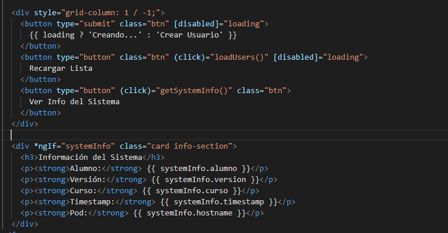

Modificando en el typescript: frontend/src/app/app.component.ts

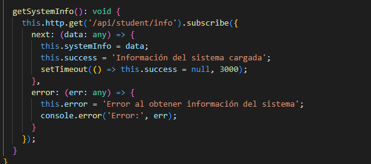

#### 3.2 Build Imagen Frontend v2.2

Los links de las images se encuentran en microk8s registry local

```bash
curl http://localhost:32000/v2/angular-frontend/tags/list
{"name":"angular-frontend","tags":["v2.2","v2.0"]}
```
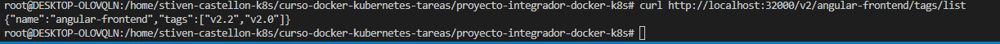

#### 3.3 Actualizar Deployment

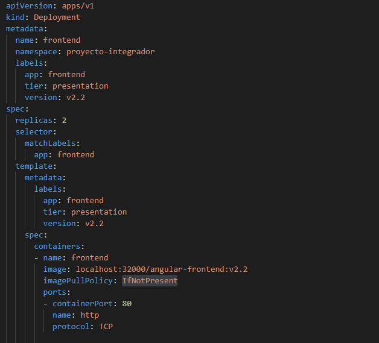

#### 3.4 Aplicar Cambios

Captura de los pods actualizando durante el rollout

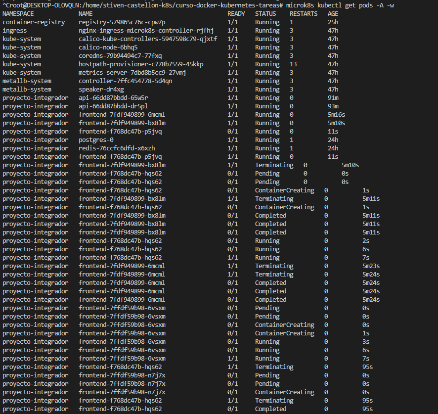

Captura del rollout status

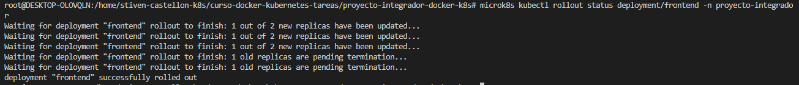


#### 3.5 Verificar Funcionamiento

Captura del nuevo boton agregado en el frontend:

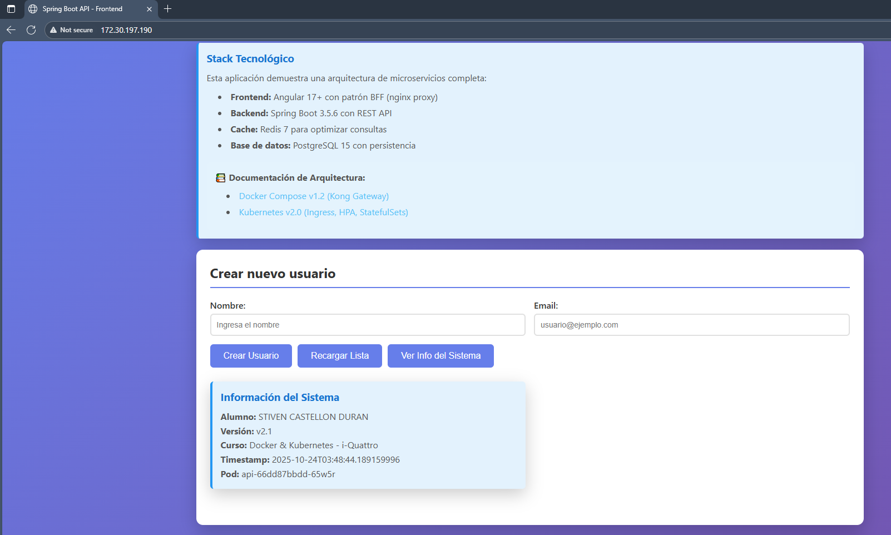

Exponiendo los puertos con metalLB:

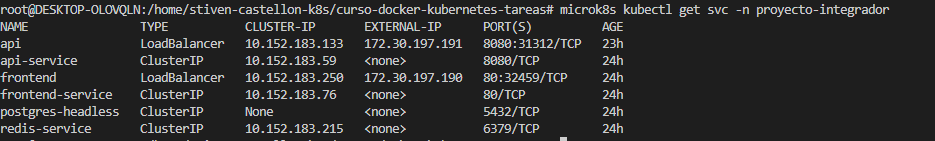


## Parte 4: Gestión de Versiones con Rollout

### Objetivo
Aprender a gestionar versiones de deployments usando comandos de rollout (rollback, rollforward, historial).

#### 4.1 Ver Historial de Rollouts

```bash
# Ver historial del backend
kubectl rollout history deployment/api -n proyecto-integrador
```
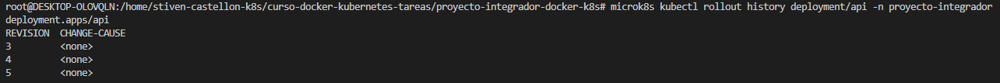

```bash
# Ver historial del frontend
kubectl rollout history deployment/frontend -n proyecto-integrador
```

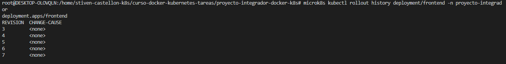


#### 4.2 Hacer Rollback a Versión Anterior

```bash
# Rollback del backend a v2.0
kubectl rollout undo deployment/api -n proyecto-integrador
```

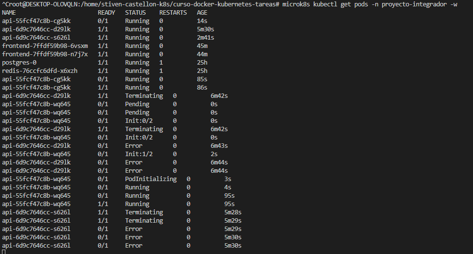

```bash
# Ver el proceso
kubectl rollout status deployment/api -n proyecto-integrador
```

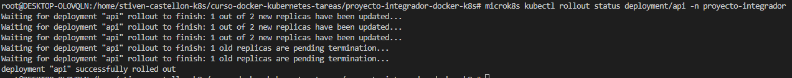

```bash
# Verificar que el endpoint /api/student/info ya NO existe
http://172.30.197.191:8080/api/student/info
# Debería dar error 404
```

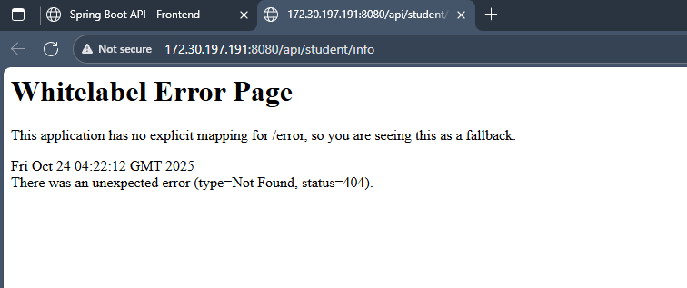

```bash
# Verificar
curl http://172.30.197.191:8080/api/student/info
# Debería dar error 404
```

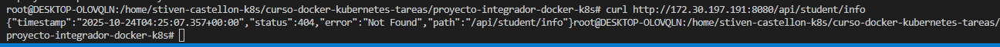

#### 4.3 Volver a la Versión v2.1 (Rollforward).

```bash
# Ver historial actualizado
kubectl rollout history deployment/api -n proyecto-integrador
```

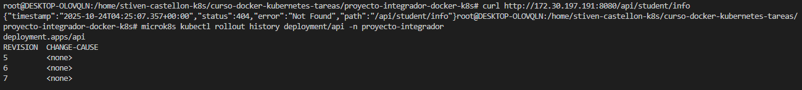

```bash
# Rollback a la revisión 2 (que es v2.1)
kubectl rollout undo deployment/api --to-revision=5 -n proyecto-integrador
```
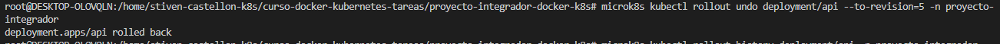

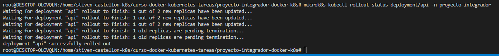

```bash
# Verificar
curl http://172.30.197.191:8080/api/student/info
# Debería funcionar nuevamente
```
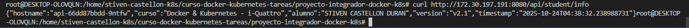

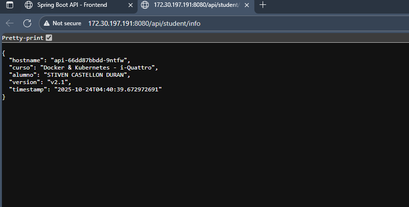

#### Explicación en tus propias palabras: ¿Qué hace `kubectl rollout undo`?

Rollout permite hacer un rollback de un deployment actual a uno anterior, es como deshacer los utlimos cambios realizados 

---

## Parte 5: Acceso Externo via Ingress + MetalLB 

### Objetivo
Verificar que el acceso externo funciona correctamente sin necesidad de port-forward, simulando un entorno cloud real.


#### 5.1 Verificar Configuración de Ingress

```bash
# Ver configuración del Ingress
kubectl get ingress -n proyecto-integrador
```
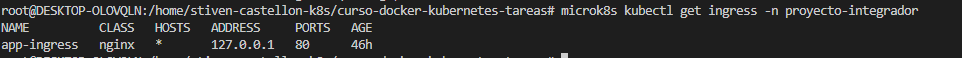

```bash
# Ver detalles
kubectl describe ingress app-ingress -n proyecto-integrador
```

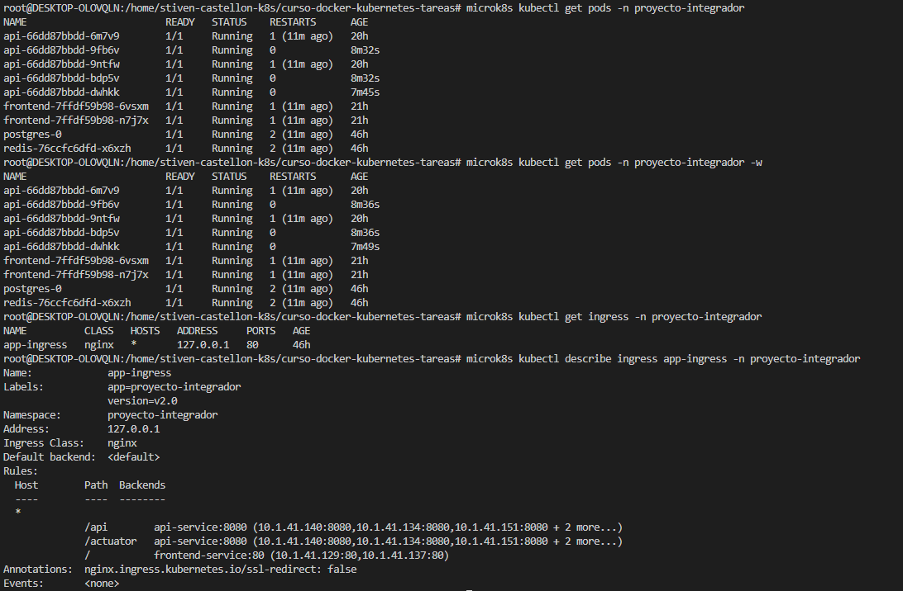

#### 5.2 Verificar MetalLB

```bash
# Ver servicios de MetalLB
kubectl get svc -n proyecto-integrador
```
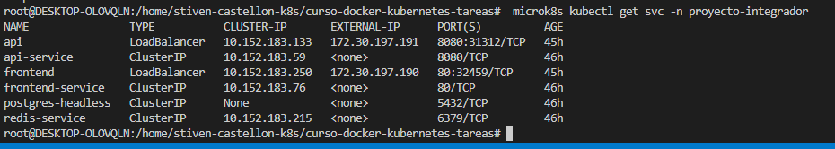

```bash
# Ver configuración de MetalLB
kubectl get ipaddresspool -n metallb-system
```

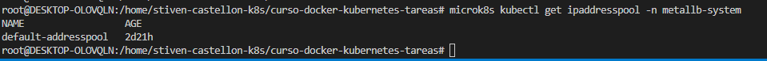

#### 5.3 Probar TODOS los Endpoints via IP Externa

Desde el navegador o curl, probar:

```bash
# Frontend
curl http://172.30.197.190/
```

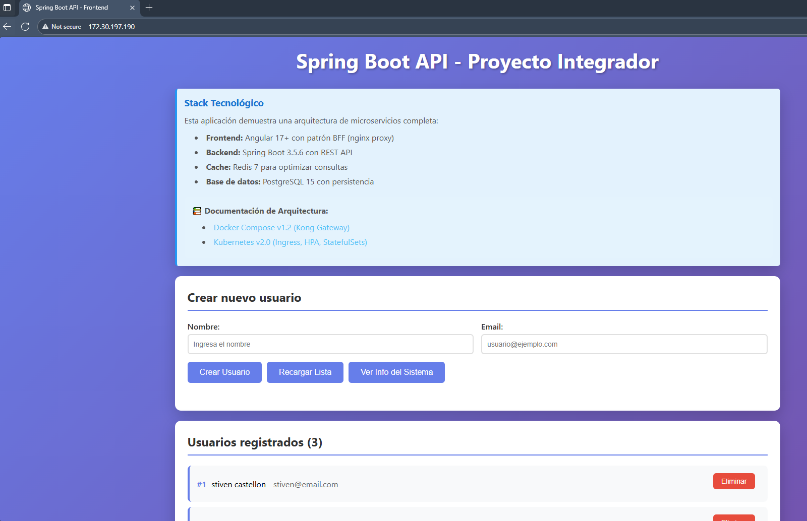

```bash
# API Users
curl http://172.30.197.191:8080/api/users
```
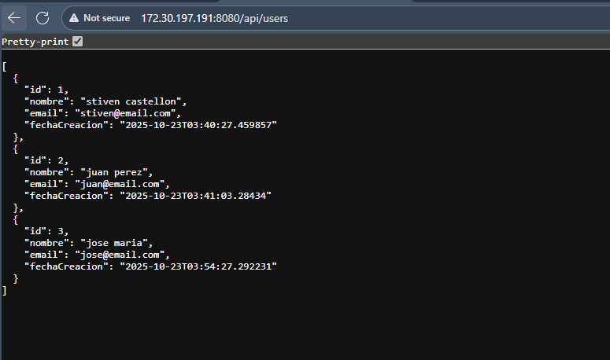

```bash
# API Greeting
curl http:///172.30.197.191:8080/api/greeting
```
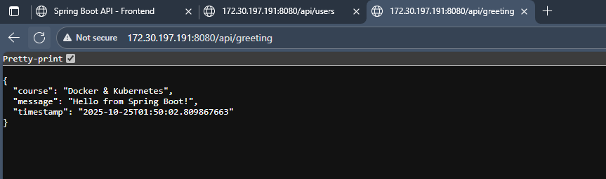

```bash
# API Info (nuevo)
curl http://172.30.197.191:8080/api/student/info
```

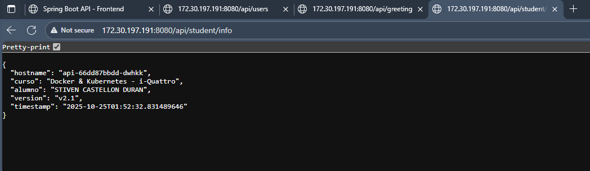

```bash
# Actuator Health
curl http://172.30.197.191:8080/actuator/health
```

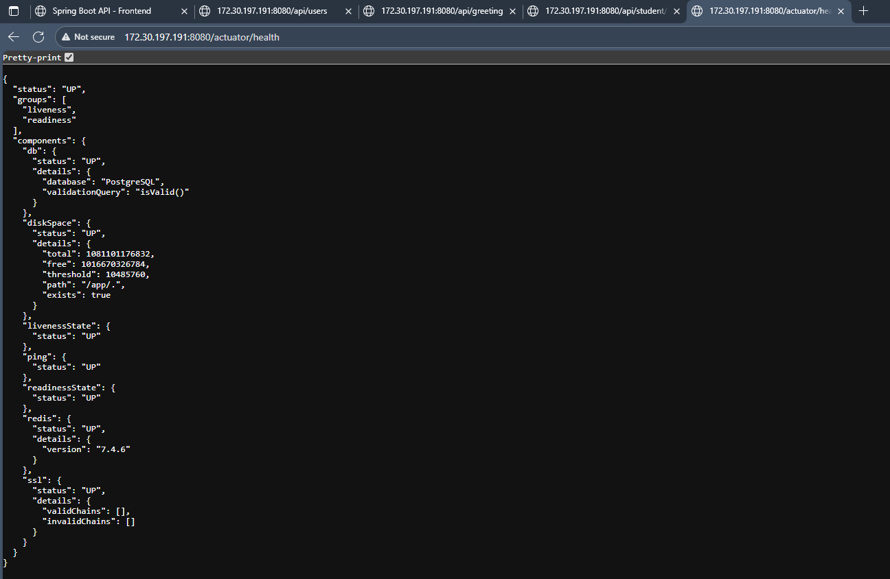