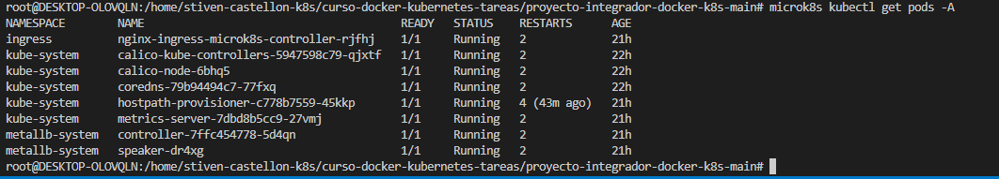
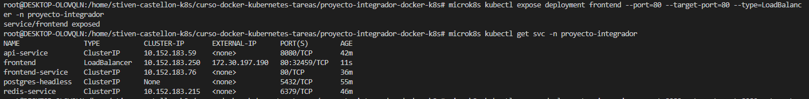
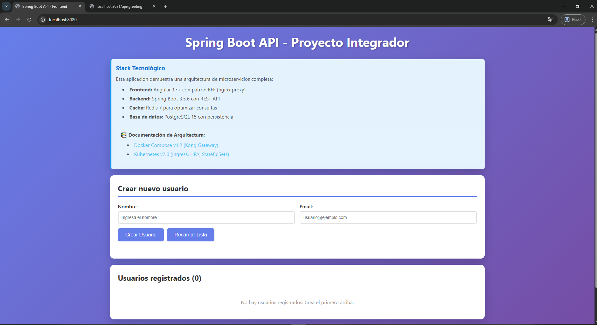
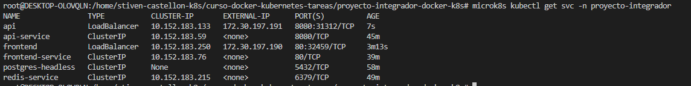
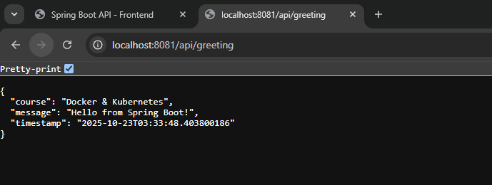
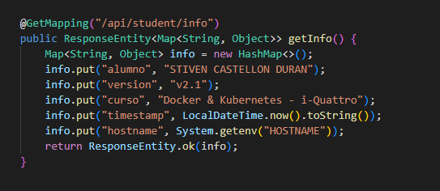
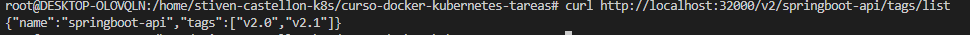
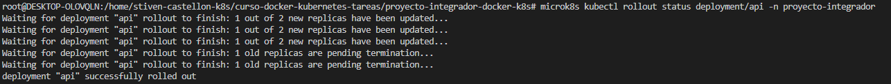
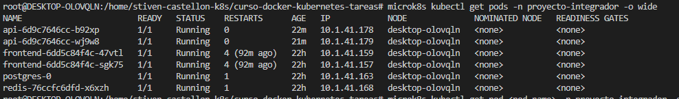

  # Proyecto Final - Docker & Kubernetes

   **Alumno:** Stiven Castellon Duran <br>
   **Fecha:** 22/10/2025 <br>
   **Curso:** Docker & Kubernetes - i-Quattro <br>

## Links de Docker Hub
- Backend v2.1: https://hub.docker.com/r/tu-usuario/springboot-api/tags
- Frontend v2.2: https://hub.docker.com/r/tu-usuario/angular-frontend/tags


**Ambiente utilizado:**
   - VirutalBox 
   - Nombre de VM/Instancia: [stiven-castellon-k8s]
   - Sistema operativo: Ubuntu 24.04.3 LTS (Noble Numbat)
   - Recursos:
 | H/W path     | Device   | Class      | Description                          |
 |---------------|-----------|------------|--------------------------------------|
 |               |           | system     | Computer                             |
 | /0            |           | bus        | Motherboard                          |
 | /0/1          |           | memory     | 4 GiB System memory                  |
 | /0/2          |           | processor  | Intel(R) Core(TM) i7 CPU 860 @ 2.80 GHz |
 | /0/3          |           | generic    | Virtio file system                   |
 | /0/3/0        |           | generic    | Virtual I/O device                   |
 | /0/4          |           | display    | Basic Render Driver                  |
 | /0/0          |           | storage    | Virtio 1.0 console                   |
 | /0/0/0        |           | generic    | Virtual I/O device                   |
 | /0/5          |           | system     | PnP device PNP0b00                   |
 | /0/6          | scsi0     | storage    |                                      |
 | /0/6/0.0.0    | /dev/sda  | volume     | 388 MiB Virtual Disk                 |
 | /0/6/0.0.1    | /dev/sdb  | volume     | 1 GiB Virtual Disk                   |
 | /0/6/0.0.2    | /dev/sdc  | volume     | 1 TiB Virtual Disk                   |
 | /0/6/0.0.3    | /dev/sdd  | volume     | 1 TiB Virtual Disk                   |
 | /1            | usb1      | bus        | USB/IP Virtual Host Controller       |
 | /2            | usb2      | bus        | USB/IP Virtual Host Controller       |
 | /3            | eth0      | network    | Ethernet interface                   |

   - Rango MetalLB:
```bash
microk8s kubectl get ipaddresspool default-addresspool -n metallb-system -o jsonpath='{.spec.addresses[0]}'
172.30.197.190-172.30.197.200
```

   ### Screenshots
   
   
   


Exponiendo la IPAddress del frontend a traves de MetalLB
```bash
microk8s kubectl expose deployment frontend --port=80 --target-port=80 --type=LoadBalancer -n proyecto-integrador
```
Resultado:




Exponiendo la IPAddress del backend a traves de MetalLB

```bash
microk8s kubectl expose deployment api --port=8080 --target-port=8080 --type=LoadBalancer -n proyecto-integrador
```
Resultado:




---

## Parte 2: Iteración v2.1 
### Objetivo
Agregar un nuevo endpoint en el backend, versionar la imagen como v2.1, publicarla en tu Docker Hub y actualizar el deployment.

Captura del codigo agregado:



Captura de las images creadas con el tag: v2.1


Las images fueron creadas en microk8s registry



Estado del rollout aplicado al deployment



Verificando los Pods



Captura del CURL al nuevo endopoint, se cambio la ruta porque ya existia uno definido en el codigo, para evitar error de ambiguedad al iniciar la aplicacion se cambio el endpoint


## Parte 3: Iteración v2.2 - Modificar Frontend